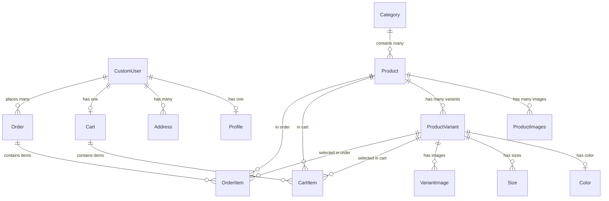
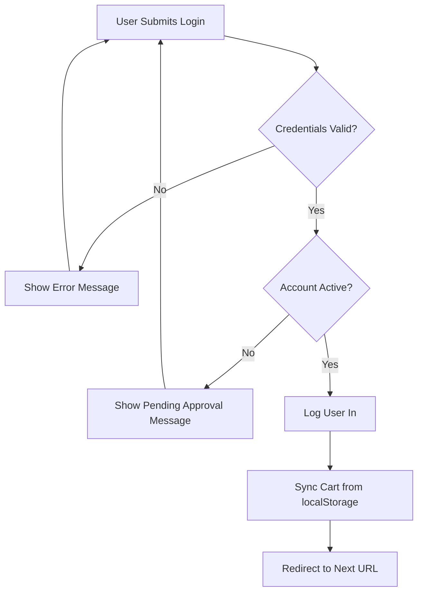

# Alwesam-Talabat Complete Documentation

## 📚 Documentation Index

Welcome to the comprehensive documentation for the Alwesam-Talabat e-commerce platform. This documentation suite covers everything from project architecture to deployment and user guides.

---

## 🚀 Quick Start

**For Developers**: Start with [Developer Setup Guide](08_DEVELOPER_SETUP.md)

**For System Admins**: See [Deployment Guide](07_DEPLOYMENT_GUIDE.md)

**For End Users**: Read the [User Guide](09_USER_GUIDE.md)

**For Understanding the System**: Begin with [Project Overview](01_PROJECT_OVERVIEW.md)

---

## 📖 Documentation Structure

### 1. [Project Overview](01_PROJECT_OVERVIEW.md)

**Purpose**: High-level introduction to the project

**Contents**:

- Project description and key features
- Technology stack
- Architecture and design patterns
- Core modules overview (accounts, products, cart, orders, home/admin)
- Security measures
- Performance optimizations

**Who should read**: Everyone - developers, admins, project managers

---

### 2. [Database Schema](02_DATABASE_SCHEMA.md)

**Purpose**: Complete database design documentation

**Contents**:

- Entity Relationship Diagram (ERD)
- Detailed model specifications
- All database tables with fields, types, and constraints
- Relationships and foreign keys
- Indexes and performance considerations
- Migration strategy

**Who should read**: Backend developers, database administrators

---

### 3. [API Endpoints](03_API_ENDPOINTS.md)

**Purpose**: Complete API reference

**Contents**:

- All URL routes and patterns
- View functions and their purposes
- Request/response formats
- Authentication requirements
- Query parameters
- Rate limiting configuration
- Error responses

**Who should read**: Frontend developers, backend developers, API integrators

---

### 4. [Authentication & Authorization](04_AUTHENTICATION.md)

**Purpose**: Security and access control documentation

**Contents**:

- Custom user model implementation
- Email/phone authentication system
- Custom authentication backend
- User approval workflow
- Permission levels (anonymous, authenticated, staff, superuser)
- Rate limiting
- Session management
- Security best practices
- CSRF protection

**Who should read**: Backend developers, security auditors, system administrators

---

### 5. [Frontend Components](05_FRONTEND_COMPONENTS.md)

**Purpose**: Frontend architecture and implementation

**Contents**:

- Template structure (base, apps, blocks)
- JavaScript modules:
  - Main script (theme, language, animations)
  - Cart enhancements (localStorage, sync, AJAX)
  - Validation (form validation, product selection)
- CSS architecture:
  - Design system (variables, colors, spacing)
  - Component styles (cards, buttons, forms)
  - RTL support
  - Dark theme implementation
  - Responsive design
- Accessibility features
- Performance optimizations

**Who should read**: Frontend developers, UI/UX designers

---

### 6. [Admin Panel](06_ADMIN_PANEL.md)

**Purpose**: Custom admin dashboard documentation

**Contents**:

- Dashboard overview and metrics
- Product management (CRUD operations, variants, images)
- Category management
- Order management (search, status updates)
- User management (approval workflow, activation/deactivation)
- Search functionality
- Admin workflows and best practices

**Who should read**: System administrators, staff members, backend developers

---

### 7. [Deployment Guide](07_DEPLOYMENT_GUIDE.md)

**Purpose**: Production deployment instructions

**Contents**:

- Environment configuration
- Database setup (PostgreSQL)
- Migrating from SQLite to PostgreSQL
- Static files collection
- Application server (Gunicorn)
- Web server (Nginx)
- SSL/TLS setup (Let's Encrypt)
- Security hardening
- Performance optimization (caching, connection pooling)
- Monitoring and logging
- Backup strategies
- Update procedures

**Who should read**: DevOps engineers, system administrators

---

### 8. [Developer Setup Guide](08_DEVELOPER_SETUP.md)

**Purpose**: Local development environment setup

**Contents**:

- System requirements
- Installation steps (Python, venv, dependencies)
- Environment configuration
- Database setup
- Creating test data
- Development workflow
- Testing procedures
- Code style guidelines
- Git workflow
- IDE setup (VS Code, PyCharm)
- Troubleshooting

**Who should read**: New developers joining the project

---

### 9. [User Guide](09_USER_GUIDE.md)

**Purpose**: End-user instructions

**Contents**:

- Getting started
- Account registration and approval
- Logging in
- Browsing and searching products
- Product variants (colors, sizes)
- Cart management
- Placing orders
- Order tracking
- Profile management
- Theme and language settings
- FAQ
- Troubleshooting

**Who should read**: End users, customer support

---

## 🎯 Key Features Summary

### E-commerce Features

- ✅ Product catalog with categories
- ✅ Product variants (colors, sizes)
- ✅ Shopping cart with localStorage for guests
- ✅ Order management system
- ✅ Order status tracking
- ✅ User profiles with addresses

### Authentication & Security

- ✅ Custom email/phone authentication
- ✅ Admin approval workflow for new users
- ✅ Rate limiting (login, cart operations)
- ✅ CSRF protection
- ✅ Password validation
- ✅ Session security

### Admin Features

- ✅ Custom admin panel
- ✅ Product management (CRUD)
- ✅ Category management
- ✅ Order processing
- ✅ User approval system
- ✅ Search across products, orders, users

### User Experience

- ✅ RTL support (Arabic)
- ✅ Dark/Light theme toggle
- ✅ Responsive design
- ✅ Image galleries
- ✅ Smooth animations
- ✅ Mobile-optimized

### Technical Features

- ✅ Image compression on upload
- ✅ Database query optimization
- ✅ Automatic slug generation
- ✅ Debug toolbar (development)
- ✅ Logging system
- ✅ Environment-based configuration

---

## 🛠️ Technology Stack

### Backend

- **Django** 5.2.8 - Web framework
- **Python** 3.10+ - Programming language
- **SQLite** - Development database
- **PostgreSQL** - Production database (recommended)
- **Pillow** - Image processing

### Frontend

- **HTML5** - Structure
- **CSS3** - Styling with custom design system
- **JavaScript** - Interactivity (vanilla JS)
- **No framework** - Lightweight and fast

### Deployment

- **Gunicorn** - WSGI application server
- **Nginx** - Web server and reverse proxy
- **Let's Encrypt** - SSL certificates
- **Systemd** - Service management

### Development Tools

- **python-decouple** - Environment management
- **django-ratelimit** - Rate limiting
- **django-debug-toolbar** - Development debugging

---

## 📊 Project Statistics

- **Django Apps**: 5 (accounts, products, cart, orders, home)
- **Database Models**: 13
- **API Endpoints**: 40+
- **Templates**: 30+
- **Static Files**: CSS (13 files), JS (3 files)
- **Documentation Pages**: 9

---

## 🔗 Quick Reference

### Common Commands

```bash
# Development
python manage.py runserver
python manage.py migrate
python manage.py createsuperuser

# Production
gunicorn project.wsgi:application
python manage.py collectstatic
sudo systemctl restart nginx
```

### Important URLs

```
Homepage:           /
Products:           /products/
Cart:               /cart/
Orders:             /orders/
Profile:            /accounts/profile/
Admin Panel:        /admin-panel/
Django Admin:       /admin/
```

### File Locations

```
Settings:           project/settings.py
URL Config:         project/urls.py
Static Files:       static/
Templates:          templates/
Media Uploads:      media/
Logs:               logs/
```

---

## 🤝 Contributing

### Before Contributing

1. Read [Developer Setup Guide](08_DEVELOPER_SETUP.md)
2. Understand project architecture from [Project Overview](01_PROJECT_OVERVIEW.md)
3. Follow Django and Python best practices
4. Write tests for new features
5. Update documentation for changes

### Code Style

- Follow PEP 8 for Python code
- Use meaningful variable names
- Comment complex logic
- Write docstrings for functions/classes

---

## 📝 License

[Specify your license here]

---

## 👥 Support

For questions or issues:

- Review relevant documentation section
- Check FAQ in [User Guide](09_USER_GUIDE.md)
- Contact development team

---

## 🗺️ Documentation Roadmap

### Completed ✅

- Project Overview
- Database Schema
- API Endpoints
- Authentication System
- Frontend Components
- Admin Panel
- Deployment Guide
- Developer Setup
- User Guide

### Future Additions 📋

- API Integration Guide (for third-party services)
- Testing Guide (unit tests, integration tests)
- Performance Tuning Guide
- Scaling Guide (load balancing, caching strategies)
- Migration Guide (version upgrades)
- Security Audit Checklist
- Internationalization Guide

---

**Last Updated**: December 2025

**Version**: 1.0

**Project**: Alwesam-Talabat E-commerce Platform
# Alwesam-Talabat: Complete Project Documentation

## Table of Contents

1. [Project Overview](#project-overview)
2. [Architecture & Design Patterns](#architecture--design-patterns)
3. [Database Schema](#database-schema)
4. [API Endpoints](#api-endpoints)
5. [Authentication & Authorization](#authentication--authorization)
6. [Frontend Components](#frontend-components)
7. [Admin Panel](#admin-panel)
8. [Deployment Guide](#deployment-guide)
9. [Developer Guide](#developer-guide)
10. [User Guide](#user-guide)

---

## Project Overview

### Description

**Alwesam-Talabat** is a comprehensive wholesale e-commerce platform built with Django 5.2.8. The system is designed specifically for bulk sales (carton-based ordering) with advanced features for product management, order processing, and user administration.

### Key Features

- 🛒 **Smart Shopping Cart**: AJAX-powered cart with localStorage support for guest users
- 📦 **Advanced Order System**: Complete order lifecycle management with status tracking
- 👤 **Custom User Management**: Email/phone authentication with admin approval workflow
- 🎨 **Theme Support**: Light/Dark mode toggle with session persistence
- 🌐 **RTL Support**: Full Arabic language support with right-to-left layout
- 🔐 **Enhanced Security**: Rate limiting, CSRF protection, and password validation
- ⚡ **Performance Optimized**: Database indexing, query optimization, and caching
- 📊 **Comprehensive Admin Panel**: Custom-built admin dashboard for complete system management

### Technology Stack

- **Backend Framework**: Django 5.2.8
- **Database**: SQLite (Development) / PostgreSQL (Production recommended)
- **Image Processing**: Pillow with custom compression utilities
- **Configuration**: python-decouple for environment management
- **Security**: django-ratelimit for rate limiting
- **Development Tools**: django-debug-toolbar

---

## Architecture & Design Patterns

### Project Structure

```
alwesam-talabat1/
├── accounts/              # User authentication and profile management
├── products/              # Product catalog and categories
├── cart/                  # Shopping cart functionality
├── orders/                # Order processing and management
├── home/                  # Homepage and custom admin panel
├── utils/                 # Shared utilities and helpers
├── core/                  # Project constants and configurations
├── static/                # Static assets (CSS, JS, Images)
├── templates/             # HTML templates
├── media/                 # User-uploaded files
├── logs/                  # Application logs
└── project/               # Django project settings
```

### Design Patterns

#### 1. **MVC (Model-View-Controller) Pattern**

Django follows the MVT (Model-View-Template) variation:

- **Models**: Define data structure and business logic
- **Views**: Handle request processing and business logic
- **Templates**: Render HTML with dynamic content

#### 2. **Repository Pattern**

Each Django app acts as a repository for its domain:

- `accounts/`: User data and authentication
- `products/`: Product catalog
- `cart/`: Shopping cart state
- `orders/`: Order transactions

#### 3. **Middleware Pattern**

Custom middleware for cross-cutting concerns:

- `CheckUserActiveMiddleware`: Validates user authentication status
- Session management for theme/language preferences
- CSRF protection and security headers

#### 4. **Context Processor Pattern**

Global template variables:

- `theme_processor`: Current theme (light/dark)
- `pending_users_count`: Admin notification count
- `cart_count`: Global cart item counter

#### 5. **Signal Pattern**

Django signals for decoupled operations:

- Profile creation on user registration
- Cart synchronization on login

### Core Modules

#### Accounts Module

- **Purpose**: User authentication, profile management, and theme preferences
- **Key Features**:
  - Custom user model with email as primary identifier
  - Dual authentication (email/phone)
  - Admin approval workflow for new users
  - Profile management with image compression
  - Multiple address support
  - Theme and language preferences

#### Products Module

- **Purpose**: Product catalog, categories, and variant management
- **Key Features**:
  - Category-based organization
  - Product variants (colors, sizes)
  - Multiple product images
  - Slug-based URLs for SEO
  - Availability tracking
  - Automatic image compression

#### Cart Module

- **Purpose**: Shopping cart management with guest support
- **Key Features**:
  - User-specific carts (database)
  - Guest cart via localStorage
  - Automatic cart synchronization on login
  - Unit type support (pieces/cartons)
  - Variant and size selection
  - Real-time updates via AJAX

#### Orders Module

- **Purpose**: Order creation, tracking, and management
- **Key Features**:
  - Order lifecycle management
  - Status tracking (pending, confirmed, shipped, delivered, cancelled)
  - Order history for users
  - Preserved variant information
  - Total calculations (pieces/cartons)
  - Admin order management

#### Home Module

- **Purpose**: Homepage and custom admin panel
- **Key Features**:
  - Landing page
  - Custom admin dashboard
  - Product management (CRUD)
  - Category management
  - Order management
  - User approval system
  - Search functionality

### Security Measures

1. **Authentication Security**:
   - Password hashing with Django's PBKDF2
   - Email/Phone dual authentication
   - Rate limiting on login (5 attempts/minute)
   - CSRF protection on all forms
   - Session-based authentication

2. **Data Security**:
   - SQL injection protection (ORM)
   - XSS protection (template auto-escaping)
   - Secure password validation
   - Environment-based secret key

3. **Access Control**:
   - Login required decorators
   - Staff member required for admin
   - User approval workflow
   - Active user middleware check

### Performance Optimizations

1. **Database Optimization**:
   - Strategic indexing on frequently queried fields
   - `select_related()` for foreign key queries
   - `prefetch_related()` for many-to-many queries
   - Database-level aggregations

2. **Image Optimization**:
   - Custom `ImageCompressionMixin` for automatic compression
   - WebP format support
   - Thumbnail generation

3. **Query Optimization**:
   - Reduced N+1 queries with prefetching
   - Lazy loading where appropriate
   - Database indexes on slug, category, availability

4. **Caching Strategy**:
   - Local memory cache (development)
   - 15-minute default timeout
   - Ready for Redis/Memcached in production

---

*Continue to the next sections for detailed documentation on Database Schema, API Endpoints, and more.*
# Database Schema Documentation

## Overview

The database schema is designed to support a wholesale e-commerce platform with support for product variants, shopping carts, and order management. The schema uses SQLite for development and is compatible with PostgreSQL for production.

---

## Entity Relationship Diagram



---

## Models Documentation

### Accounts App

#### CustomUser

**Purpose**: Extended Django user model with email as primary authentication field

| Field | Type | Description | Constraints |
|-------|------|-------------|-------------|
| `username` | CharField(150) | Username for display | Unique |
| `email` | EmailField | Primary authentication field | Unique, Required |
| `phone` | CharField(20) | Phone number | Required |
| `address` | TextField | Primary address | Required |
| `is_active` | BooleanField | Account activation status | Default: False (requires admin approval) |
| `is_staff` | BooleanField | Staff status | Default: False |
| `is_superuser` | BooleanField | Superuser status | Default: False |

**Key Features**:

- **USERNAME_FIELD**: `email`
- **REQUIRED_FIELDS**: `['username', 'phone', 'address']`
- Inherits from `AbstractUser`
- Custom authentication backend supports email/phone login

#### Profile

**Purpose**: Additional user profile information with image

| Field | Type | Description | Constraints |
|-------|------|-------------|-------------|
| `user` | OneToOneField(CustomUser) | User relationship | Cascade on delete |
| `bio` | TextField | User biography | Optional |
| `image` | ImageField | Profile picture | Optional, Compressed on save |

**Key Features**:

- Uses `ImageCompressionMixin` for automatic image optimization
- Auto-created via signals when user is created
- Upload path: `user-image/`

#### Address

**Purpose**: Multiple shipping addresses per user

| Field | Type | Description | Constraints |
|-------|------|-------------|-------------|
| `user` | ForeignKey(CustomUser) | User relationship | Cascade on delete |
| `label` | CharField(50) | Address label (e.g., "Home") | Default: "المنزل" |
| `street` | CharField(255) | Street address | Required |
| `city` | CharField(100) | City | Required |
| `state` | CharField(100) | State/Province | Required |
| `postal_code` | CharField(20) | Postal code | Optional |
| `country` | CharField(100) | Country | Default: "مصر" |
| `is_default` | BooleanField | Default address flag | Default: False |

---

### Products App

#### Category

**Purpose**: Product categorization

| Field | Type | Description | Constraints |
|-------|------|-------------|-------------|
| `name` | CharField(200) | Category name | Required |
| `slug` | CharField(255) | URL-friendly name | Unique, Auto-generated, Indexed |
| `description` | TextField | Category description | Optional |
| `image` | ImageField | Category image | Required, Compressed on save |

**Indexes**:

- `slug` (unique index for fast URL lookups)

#### Product

**Purpose**: Main product information

| Field | Type | Description | Constraints |
|-------|------|-------------|-------------|
| `name` | CharField(200) | Product name | Required |
| `description` | TextField | Product description | Optional |
| `pcs_carton` | PositiveIntegerField | Pieces per carton | Default: 24 |
| `slug` | CharField(255) | URL-friendly name | Unique, Auto-generated, Indexed |
| `image` | ImageField | Main product image | Required, Compressed on save |
| `category` | ForeignKey(Category) | Product category | Nullable, SET_NULL on delete |
| `is_available` | BooleanField | Availability status | Default: True, Indexed |
| `created_at` | DateTimeField | Creation timestamp | Auto-generated |
| `updated_at` | DateTimeField | Last update timestamp | Auto-updated |

**Indexes**:

- `['category', '-created_at']` (composite index for category listings)
- `['-created_at']` (for latest products)
- `['is_available']` (for filtering available products)

**Ordering**: `-created_at` (newest first)

#### ProductVariant

**Purpose**: Product variations (colors, sizes, etc.)

| Field | Type | Description | Constraints |
|-------|------|-------------|-------------|
| `product` | ForeignKey(Product) | Parent product | Cascade on delete |
| `variant_type` | CharField(20) | Type of variant | Choices: `[('color', 'اللون')]` |
| `name` | CharField(200) | Variant name | Required |
| `code` | CharField(50) | Variant SKU | Unique, Optional |
| `pcs_carton` | PositiveIntegerField | Pieces per carton for variant | Default: 24 |
| `image` | ImageField | Variant-specific image | Optional, Compressed on save |
| `color` | ForeignKey(Color) | Associated color | Nullable, SET_NULL on delete |
| `sizes` | ManyToManyField(Size) | Available sizes | Optional |
| `is_available` | BooleanField | Availability status | Default: True, Indexed |
| `created_at` | DateTimeField | Creation timestamp | Auto-generated |

**Indexes**:

- `['is_available']` (for filtering)
- `['product', 'is_available']` (composite index for product variant queries)

**Constraints**:

- `unique_together`: `['product', 'code']`

#### Color

**Purpose**: Available colors for variants

| Field | Type | Description | Constraints |
|-------|------|-------------|-------------|
| `name` | CharField(50) | Color name | Required |
| `hex_code` | CharField(7) | Hex color code | Required (e.g., #FF0000) |
| `created_at` | DateTimeField | Creation timestamp | Auto-generated |

**Ordering**: `name`

#### Size

**Purpose**: Available sizes/lengths for variants

| Field | Type | Description | Constraints |
|-------|------|-------------|-------------|
| `name` | CharField(50) | Size name | Required |
| `order` | PositiveIntegerField | Display order | Default: 0 |
| `created_at` | DateTimeField | Creation timestamp | Auto-generated |

**Ordering**: `['order', 'name']`

#### ProductImages

**Purpose**: Additional product images (gallery)

| Field | Type | Description | Constraints |
|-------|------|-------------|-------------|
| `product` | ForeignKey(Product) | Parent product | Cascade on delete |
| `image` | ImageField | Image file | Required, Compressed on save |
| `order` | PositiveIntegerField | Display order | Default: 0 |
| `created_at` | DateTimeField | Creation timestamp | Auto-generated |

**Ordering**: `['order', 'created_at']`

#### VariantImage

**Purpose**: Multiple images for product variants

| Field | Type | Description | Constraints |
|-------|------|-------------|-------------|
| `variant` | ForeignKey(ProductVariant) | Parent variant | Cascade on delete |
| `image` | ImageField | Image file | Required, Compressed on save |
| `order` | PositiveIntegerField | Display order | Default: 0 |
| `created_at` | DateTimeField | Creation timestamp | Auto-generated |

**Ordering**: `['order', 'created_at']`

---

### Cart App

#### Cart

**Purpose**: Shopping cart container for authenticated users

| Field | Type | Description | Constraints |
|-------|------|-------------|-------------|
| `user` | OneToOneField(CustomUser) | Cart owner | Cascade on delete |
| `created_at` | DateTimeField | Creation timestamp | Auto-generated |
| `updated_at` | DateTimeField | Last update timestamp | Auto-updated |

**Methods**:

- `get_item_count()`: Returns total quantity across all items

#### CartItem

**Purpose**: Individual items in shopping cart

| Field | Type | Description | Constraints |
|-------|------|-------------|-------------|
| `cart` | ForeignKey(Cart) | Parent cart | Cascade on delete |
| `product` | ForeignKey(Product) | Product | Cascade on delete |
| `variant` | ForeignKey(ProductVariant) | Selected variant | Nullable, SET_NULL on delete |
| `quantity` | PositiveIntegerField | Quantity (always in pieces) | Default: 1 |
| `unit_type` | CharField(10) | Unit type | Choices: `[('piece', 'قطعة'), ('carton', 'كرتونة')]` |
| `size_name` | CharField(100) | Selected size name | Optional |

**Constraints**:

- `unique_together`: `['cart', 'product', 'variant', 'unit_type', 'size_name']`

**Methods**:

- `get_pcs_carton()`: Returns pcs_carton from variant or product
- `get_quantity_in_cartons()`: Converts pieces to cartons
- `get_quantity_in_pieces()`: Returns quantity in pieces
- `get_display_name()`: Returns formatted product name with variant info

---

### Orders App

#### Order

**Purpose**: Customer order container

| Field | Type | Description | Constraints |
|-------|------|-------------|-------------|
| `user` | ForeignKey(CustomUser) | Order owner | Cascade on delete |
| `created_at` | DateTimeField | Order creation time | Auto-generated |
| `updated_at` | DateTimeField | Last update time | Auto-updated |
| `status` | CharField(20) | Order status | Choices (see below), Default: 'pending' |
| `phone_number` | CharField(20) | Contact phone | Required |
| `address` | TextField | Delivery address | Optional |
| `notes` | TextField | Order notes | Optional |

**Status Choices**:

- `pending`: قيد الانتظار
- `confirmed`: تم التأكيد
- `shipped`: تم الشحن
- `delivered`: تم التسليم
- `cancelled`: تم الإلغاء

**Ordering**: `-created_at` (newest first)

**Methods**:

- `get_total_pieces()`: Returns total pieces across all order items

#### OrderItem

**Purpose**: Individual items in an order (preserves variant info at order time)

| Field | Type | Description | Constraints |
|-------|------|-------------|-------------|
| `order` | ForeignKey(Order) | Parent order | Cascade on delete |
| `product` | ForeignKey(Product) | Product | Cascade on delete |
| `variant` | ForeignKey(ProductVariant) | Selected variant | Nullable, SET_NULL on delete |
| `quantity` | PositiveIntegerField | Quantity (always in pieces) | Default: 1 |
| `unit_type` | CharField(10) | Unit type | Choices: `[('piece', 'قطعة'), ('carton', 'كرتونة')]` |
| `variant_info` | CharField(200) | Preserved variant type | Optional |
| `variant_pcs_carton` | PositiveIntegerField | Preserved pcs/carton | Optional |
| `color_name` | CharField(100) | Preserved color name | Optional |
| `size_name` | CharField(100) | Preserved size name | Optional |

**Why Preserve Variant Info?**
Variant details (color, size, pcs_carton) are saved at order time to maintain historical accuracy even if product/variant is modified or deleted later.

**Methods**:

- `get_pcs_carton()`: Returns preserved or current pcs_carton
- `get_quantity_in_cartons()`: Converts pieces to cartons
- `get_quantity_in_pieces()`: Returns quantity in pieces
- `get_total_pieces()`: Same as quantity (for consistency)
- `get_display_name()`: Returns formatted name with color/size/variant info

---

## Database Migrations

### Migration Strategy

1. Create migrations: `python manage.py makemigrations`
2. Review migrations: Check generated files in `migrations/` folders
3. Apply migrations: `python manage.py migrate`
4. Rollback if needed: `python manage.py migrate app_name migration_name`

### Current Migration State

All apps have initial migrations with the current schema. The system uses Django's built-in migration framework for schema version control.

---

## Data Integrity

### Cascading Deletes

- Deleting a **User** → Deletes Profile, Addresses, Cart, Orders
- Deleting a **Product** → Deletes ProductImages, ProductVariants, CartItems, OrderItems
- Deleting a **Category** → Sets Product.category to NULL
- Deleting a **Cart** → Deletes all CartItems
- Deleting an **Order** → Deletes all OrderItems

### SET_NULL Behaviors

- Deleting a **Category** → Product.category = NULL
- Deleting a **ProductVariant** → CartItem.variant = NULL, OrderItem.variant = NULL
- Deleting a **Color** → ProductVariant.color = NULL

---

## Performance Considerations

### Indexes

Strategic indexes are placed on:

- **Slug fields**: Fast URL lookups
- **Foreign keys**: Join optimization
- **Filtering fields**: `is_available`, `status`
- **Composite indexes**: Category + created_at for listings

### Query Optimization

- Use `select_related()` for foreign key relationships
- Use `prefetch_related()` for reverse foreign keys and many-to-many
- Aggregate queries at database level
- Avoid N+1 queries with proper prefetching

---

## Backup and Maintenance

### Backup Strategy (Production)

```bash
# PostgreSQL backup
pg_dump dbname > backup.sql

# Restore
psql dbname < backup.sql
```

### Maintenance Tasks

1. Regular vacuum (PostgreSQL)
2. Index rebuilding if performance degrades
3. Log rotation for application logs
4. Media file cleanup for deleted records
# API Endpoints & Views Documentation

## Overview

This document details all API endpoints and views in the Alwesam-Talabat platform. The application uses Django's URL routing with function-based views.

---

## URL Structure

### Root URL Configuration

```python
# project/urls.py
urlpatterns = [
    path('admin/', admin.site.urls),                    # Django admin
    path('', include('home.urls')),                     # Homepage
    path('products/', include('products.urls')),        # Products
    path('cart/', include('cart.urls')),                # Shopping cart
    path('orders/', include('orders.urls')),            # Orders
    path('accounts/', include('accounts.urls')),        # User accounts
    path('admin-panel/', include('home.admin_urls')),   # Custom admin panel
]
```

---

## Accounts App Endpoints

### Base URL: `/accounts/`

#### User Authentication

##### **Signup**

- **URL**: `/accounts/signup/`
- **Name**: `accounts:signup`
- **Method**: `GET`, `POST`
- **Authentication**: Not required
- **View**: `signup_view`

**POST Request**:

```json
{
    "username": "string",
    "email": "string",
    "phone": "string",
    "address": "string",
    "password1": "string",
    "password2": "string"
}
```

**Response**:

- Success: Redirect to `accounts:pending_approval`
- Error: Re-render form with validation errors

**Notes**:

- New users are created with `is_active=False`
- Requires admin approval before login

---

##### **Login**

- **URL**: `/accounts/login/`
- **Name**: `accounts:login`
- **Method**: `GET`, `POST`
- **Authentication**: Not required
- **Rate Limit**: 5 requests/minute per IP
- **View**: `login_view`

**POST Request**:

```json
{
    "email": "string (email or phone)",
    "password": "string"
}
```

**Response**:

- Success: Redirect to `next` parameter or homepage
- Inactive account: Warning message + re-render login
- Invalid credentials: Error message + re-render login

**Features**:

- Dual authentication (email or phone)
- Custom authentication backend
- Cart synchronization on login
- Rate limiting via `@ratelimit` decorator

---

##### **Logout**

- **URL**: `/accounts/logout/`
- **Name**: `accounts:logout`
- **Method**: `GET`
- **Authentication**: Not required
- **View**: `logout_view`

**Response**: Redirect to homepage with success message

---

##### **Pending Approval**

- **URL**: `/accounts/pending/`
- **Name**: `accounts:pending_approval`
- **Method**: `GET`
- **Authentication**: Not required
- **View**: `pending_approval_view`

**Purpose**: Displayed to users awaiting admin approval

---

#### User Profile

##### **View Profile**

- **URL**: `/accounts/profile/`
- **Name**: `accounts:profile`
- **Method**: `GET`
- **Authentication**: Required (`@login_required`)
- **View**: `profile_view`

**Response Context**:

```python
{
    'user': CustomUser,
    'recent_orders': QuerySet[Order]  # Last 5 orders
}
```

---

##### **Update Profile**

- **URL**: `/accounts/update-profile/`
- **Name**: `accounts:update_profile`
- **Method**: `GET`, `POST`
- **Authentication**: Required (`@login_required`)
- **View**: `update_profile`

**POST Request**:

```json
{
    "username": "string",
    "email": "string",
    "phone": "string",
    "address": "string"
}
```

**Response**:

- Success: Redirect to profile with success message
- Error: Re-render form with validation errors

---

#### Theme & Language

##### **Set Theme**

- **URL**: `/accounts/set-theme/`
- **Name**: `accounts:set_theme`
- **Method**: `POST`
- **Authentication**: Not required
- **View**: `set_theme`

**POST Request (JSON)**:

```json
{
    "theme": "theme-light" | "theme-dark"
}
```

**Response (JSON)**:

```json
{
    "success": true,
    "theme": "theme-light"
}
```

---

##### **Set Language**

- **URL**: `/accounts/set-language/`
- **Name**: `accounts:set_language`
- **Method**: `POST`
- **Authentication**: Not required
- **View**: `set_language`

**POST Request (JSON)**:

```json
{
    "language": "ar" | "en"
}
```

**Response (JSON)**:

```json
{
    "success": true,
    "language": "ar"
}
```

---

##### **Get Theme**

- **URL**: `/accounts/get-theme/`
- **Name**: `accounts:get_theme`
- **Method**: `GET`
- **Authentication**: Not required
- **View**: `get_theme`

**Response (JSON)**:

```json
{
    "theme": "theme-light"
}
```

---

##### **Get Language**

- **URL**: `/accounts/get-language/`
- **Name**: `accounts:get_language`
- **Method**: `GET`
- **Authentication**: Not required
- **View**: `get_language`

**Response (JSON)**:

```json
{
    "language": "ar"
}
```

---

## Products App Endpoints

### Base URL: `/products/`

##### **All Categories**

- **URL**: `/products/`
- **Name**: `products:all_categories`
- **Method**: `GET`
- **Authentication**: Not required
- **View**: `all_categories`

**Response Context**:

```python
{
    'categories': QuerySet[Category]
}
```

---

##### **Category Products**

- **URL**: `/products/category/<slug:slug>/`
- **Name**: `products:category_products`
- **Method**: `GET`
- **Authentication**: Not required
- **View**: `category_products`

**Response Context**:

```python
{
    'category': Category,
    'products': QuerySet[Product]
}
```

---

##### **Product Detail**

- **URL**: `/products/product/<slug:slug>/`
- **Name**: `products:product_detail`
- **Method**: `GET`
- **Authentication**: Not required
- **View**: `product_detail`

**Response Context**:

```python
{
    'product': Product,
    'product_images': QuerySet[ProductImages],
    'variants': QuerySet[ProductVariant],
    'related_products': QuerySet[Product]  # Max 4
}
```

---

##### **Search Products**

- **URL**: `/products/search/`
- **Name**: `products:search`
- **Method**: `GET`
- **Authentication**: Not required
- **View**: `search_products`

**Query Parameters**:

- `q`: Search query string

**Response Context**:

```python
{
    'products': QuerySet[Product],
    'query': str,
    'count': int
}
```

**Search Fields**: Product name, description, category name

---

## Cart App Endpoints

### Base URL: `/cart/`

##### **View Cart**

- **URL**: `/cart/`
- **Name**: `cart:cart_view`
- **Method**: `GET`
- **Authentication**: Required (`@login_required`)
- **View**: `cart_view`

**Response Context**:

```python
{
    'cart': Cart,
    'cart_items': QuerySet[CartItem],
    'total_items': int,
    'total_cartons': int,
    'total_pieces': int
}
```

---

##### **Add to Cart**

- **URL**: `/cart/add/<int:product_id>/`
- **Name**: `cart:add_to_cart`
- **Method**: `POST`
- **Authentication**: Required (`@login_required`)
- **View**: `add_to_cart`

**POST Request (JSON)**:

```json
{
    "variant_id": int,           // Optional
    "color_name": "string",      // Optional
    "size_name": "string",       // Optional
    "quantity": int,             // In selected unit
    "unit_type": "piece" | "carton"
}
```

**Response (JSON)**:

```json
{
    "success": true,
    "message": "تم إضافة المنتج إلى السلة",
    "cart_count": int
}
```

**Validation**:

- Checks product availability
- Validates variant if provided
- Converts quantity to pieces for storage
- Enforces maximum quantity limit

---

##### **Remove from Cart**

- **URL**: `/cart/remove/<int:item_id>/`
- **Name**: `cart:remove_from_cart`
- **Method**: `POST`
- **Authentication**: Required (`@login_required`)
- **View**: `remove_from_cart`

**Response (JSON)**:

```json
{
    "success": true,
    "message": "تم حذف المنتج من السلة"
}
```

---

##### **Update Cart Item**

- **URL**: `/cart/update/<int:item_id>/`
- **Name**: `cart:update_cart_item`
- **Method**: `POST`
- **Authentication**: Required (`@login_required`)
- **View**: `update_cart_item`

**POST Request (JSON)**:

```json
{
    "quantity": int,  // In the original unit type
    "action": "increase" | "decrease" | "set"
}
```

**Response (JSON)**:

```json
{
    "success": true,
    "message": "تم تحديث الكمية"
}
```

---

##### **Sync Cart from LocalStorage**

- **URL**: `/cart/sync/`
- **Name**: `cart:sync_cart`
- **Method**: `POST`
- **Authentication**: Required (`@login_required`)
- **View**: `sync_cart_from_local`

**POST Request (JSON)**:

```json
{
    "cart_items": [
        {
            "product_id": int,
            "variant_id": int,      // Optional
            "size_name": "string",  // Optional
            "quantity": int,
            "unit_type": "piece" | "carton"
        }
    ]
}
```

**Response (JSON)**:

```json
{
    "success": true,
    "message": "تم مزامنة السلة بنجاح"
}
```

**Purpose**: Called when user logs in to merge guest cart with user cart

---

##### **Checkout**

- **URL**: `/cart/checkout/`
- **Name**: `cart:checkout`
- **Method**: `GET`
- **Authentication**: Required (`@login_required`)
- **View**: `checkout`

**Response Context**:

```python
{
    'cart': Cart,
    'cart_items': QuerySet[CartItem],
    'user': CustomUser
}
```

---

## Orders App Endpoints

### Base URL: `/orders/`

##### **Order List**

- **URL**: `/orders/`
- **Name**: `orders:order_list`
- **Method**: `GET`
- **Authentication**: Required (`@login_required`)
- **View**: `order_list`

**Response Context**:

```python
{
    'orders': QuerySet[Order]  # User's orders, newest first
}
```

---

##### **Order Detail**

- **URL**: `/orders/<int:order_id>/`
- **Name**: `orders:order_detail`
- **Method**: `GET`
- **Authentication**: Required (`@login_required`)
- **View**: `order_detail`

**Response Context**:

```python
{
    'order': Order,
    'total_items': int,
    'total_cartons': int,
    'total_pieces': int
}
```

---

##### **Create Order**

- **URL**: `/orders/create/`
- **Name**: `orders:create_order`
- **Method**: `POST`
- **Authentication**: Required (`@login_required`)
- **View**: `create_order`

**POST Request**:

```json
{
    "phone_number": "string",
    "address": "string",
    "notes": "string"  // Optional
}
```

**Response**:

- Success: Redirect to order detail
- Error: Redirect to checkout with error message

**Process**:

1. Validates cart is not empty
2. Creates order with provided details
3. Converts cart items to order items (preserves variant info)
4. Clears user's cart
5. Returns order confirmation

---

##### **Cancel Order**

- **URL**: `/orders/<int:order_id>/cancel/`
- **Name**: `orders:cancel_order`
- **Method**: `POST`
- **Authentication**: Required (`@login_required`)
- **View**: `cancel_order`

**Response**: Redirect to order detail with status message

**Validation**:

- Only `pending` orders can be cancelled

---

## Home App Endpoints

### Base URL: `/`

##### **Homepage**

- **URL**: `/`
- **Name**: `home:home`
- **Method**: `GET`
- **Authentication**: Not required
- **View**: `home_view`

**Purpose**: Landing page with featured products/categories

---

## Admin Panel Endpoints

### Base URL: `/admin-panel/`

**Authentication**: All endpoints require staff login (`@staff_member_required`)

##### **Dashboard**

- **URL**: `/admin-panel/`
- **Method**: `GET`
- **View**: `admin_dashboard`

**Response Context**:

```python
{
    'total_products': int,
    'total_categories': int,
    'total_orders': int,
    'pending_orders': int,
    'total_users': int,
    'pending_users': int
}
```

---

##### **Manage Products**

- **URL**: `/admin-panel/products/`
- **Method**: `GET`
- **View**: `admin_products`
- **Query Parameters**: `search` (optional)

**Response Context**:

```python
{
    'products': QuerySet[Product],
    'search_query': str
}
```

---

##### **Add Product**

- **URL**: `/admin-panel/products/add/`
- **Method**: `GET`, `POST`
- **View**: `admin_product_add`

**POST Request**: Multipart form data with:

- Product details
- Main image
- Additional images (multiple)
- Variant data (if applicable)

---

##### **Edit Product**

- **URL**: `/admin-panel/products/edit/<int:product_id>/`
- **Method**: `GET`, `POST`
- **View**: `admin_product_edit`

---

##### **Delete Product**

- **URL**: `/admin-panel/products/delete/<int:product_id>/`
- **Method**: `POST`
- **View**: `admin_product_delete`

---

##### **Manage Orders**

- **URL**: `/admin-panel/orders/`
- **Method**: `GET`
- **View**: `admin_orders`
- **Query Parameters**: `search`, `status` (optional)

**Response Context**:

```python
{
    'orders': QuerySet[Order],
    'search_query': str,
    'status_filter': str
}
```

---

##### **Order Detail (Admin)**

- **URL**: `/admin-panel/orders/<int:order_id>/`
- **Method**: `GET`, `POST`
- **View**: `admin_order_detail`

**POST**: Update order status

---

##### **Manage Categories**

- **URL**: `/admin-panel/categories/`
- **Method**: `GET`
- **View**: `admin_categories`

---

##### **Add Category**

- **URL**: `/admin-panel/categories/add/`
- **Method**: `GET`, `POST`
- **View**: `admin_category_add`

---

##### **Edit Category**

- **URL**: `/admin-panel/categories/edit/<int:category_id>/`
- **Method**: `GET`, `POST`
- **View**: `admin_category_edit`

---

##### **Delete Category**

- **URL**: `/admin-panel/categories/delete/<int:category_id>/`
- **Method**: `POST`
- **View**: `admin_category_delete`

---

##### **Pending Users**

- **URL**: `/admin-panel/users/pending/`
- **Method**: `GET`
- **View**: `admin_pending_users`

**Response Context**:

```python
{
    'pending_users': QuerySet[CustomUser]
}
```

---

##### **All Users**

- **URL**: `/admin-panel/users/`
- **Method**: `GET`
- **View**: `admin_all_users`
- **Query Parameters**: `search`, `status` (all/active/inactive)

---

##### **Approve User**

- **URL**: `/admin-panel/users/approve/<int:user_id>/`
- **Method**: `POST`
- **View**: `admin_approve_user`

**Action**: Sets `is_active=True`

---

##### **Reject User**

- **URL**: `/admin-panel/users/reject/<int:user_id>/`
- **Method**: `POST`
- **View**: `admin_reject_user`

**Action**: Deletes user account

---

##### **Toggle User Status**

- **URL**: `/admin-panel/users/toggle/<int:user_id>/`
- **Method**: `POST`
- **View**: `admin_toggle_user_status`

**Action**: Toggles `is_active` status

---

## Rate Limiting

### Configured Limits

- **Login**: 5 attempts per minute (per IP)
- **Cart Operations**: 30 requests per minute (per user)

### Implementation

Uses `django-ratelimit` with IP-based and user-based keys

---

## Error Responses

### Standard Error Codes

- **400**: Bad Request (invalid data)
- **401**: Unauthorized (login required)
- **403**: Forbidden (permission denied)
- **404**: Not Found (resource doesn't exist)
- **500**: Internal Server Error

### Error Pages

- Custom **404** template
- Custom **500** template

---

## API Best Practices

### Request Headers

```http
Content-Type: application/json
X-CSRFToken: <csrf_token>  # For POST requests
```

### CSRF Protection

All POST requests require CSRF token:

- Forms: Automatically included via ``
- AJAX: Include token in `X-CSRFToken` header

### Response Format

JSON responses follow this structure:

```json
{
    "success": true | false,
    "message": "string",
    "data": {}  // Optional
}
```
# Authentication & Authorization Documentation

## Overview

The Alwesam-Talabat platform implements a custom authentication system with email/phone login, admin approval workflow, and enhanced security features.

---

## Custom User Model

### Implementation

```python
# accounts/models.py
class CustomUser(AbstractUser):
    username = CharField(max_length=150, unique=True)
    email = EmailField(unique=True)
    phone = CharField(max_length=20)
    address = TextField()
    
    USERNAME_FIELD = 'email'
    REQUIRED_FIELDS = ['username', 'phone', 'address']
```

### Key Features

- **Email as Primary Identifier**: Users log in with email (not username)
- **Mandatory Fields**: Username, email, phone, and address are required
- **Unique Constraints**: Both email and username must be unique
- **Inherits from**: `django.contrib.auth.models.AbstractUser`

---

## Authentication Backend

### Custom Backend Implementation

```python
# accounts/backends.py
class EmailPhoneBackend(ModelBackend):
    def authenticate(self, request, username=None, password=None, **kwargs):
        # Try email first
        # Try phone second
        # Validate password
        # Return user or None
```

### Authentication Flow

1. **User submits**: Email/phone + password
2. **Backend tries**: Match by email → Match by phone
3. **Validate password**: Check against hashed password
4. **Check active status**: Only active users can log in
5. **Return result**: User object or None

### Configuration

```python
# project/settings.py
AUTHENTICATION_BACKENDS = [
    'accounts.backends.EmailPhoneBackend',  # Custom
    'django.contrib.auth.backends.ModelBackend',  # Fallback
]
```

---

## User Registration & Approval Workflow

### Registration Process

#### Step 1: User Signup

```python
# accounts/views.py
def signup_view(request):
    user = form.save(commit=False)
    user.is_active = False  # Requires admin approval
    user.save()
    return redirect('accounts:pending_approval')
```

**Form Fields**:

- Username
- Email (unique)
- Phone (unique)
- Address
- Password (with confirmation)

#### Step 2: Pending Approval

User is redirected to a "pending approval" page with message:
> "حسابك في انتظار موافقة المسؤول. سيتم إشعارك عند تفعيل حسابك."

#### Step 3: Admin Review

Admin reviews new users in `/admin-panel/users/pending/`:

- **Approve**: Sets `is_active=True` → User can log in
- **Reject**: Deletes user account

#### Step 4: User Login

Once approved, user can log in normally.

---

## Login System

### Login View

```python
@ratelimit(key='ip', rate='5/m', method='POST', block=True)
def login_view(request):
    user = authenticate(request, username=username_or_phone, password=password)
    
    if user and user.is_active:
        login(request, user)
        sync_cart_on_login(request)
        return redirect(next_url)
```

### Features

- **Dual Input**: Accepts email OR phone
- **Rate Limiting**: 5 login attempts per minute (per IP)
- **Active Check**: Only active users can log in
- **Cart Sync**: Merges guest cart with user cart on login
- **Next URL**: Supports redirect after login

### Login Flow Diagram



---

## Password Security

### Validation Rules

Configured via Django's built-in validators:

```python
AUTH_PASSWORD_VALIDATORS = [
    {'NAME': 'UserAttributeSimilarityValidator'},  # Not similar to user info
    {'NAME': 'MinimumLengthValidator'},            # Minimum 8 characters
    {'NAME': 'CommonPasswordValidator'},           # Not in common passwords list
    {'NAME': 'NumericPasswordValidator'},          # Not entirely numeric
]
```

### Password Hashing

- **Algorithm**: PBKDF2 with SHA256
- **Iterations**: 600,000 (Django 5.2 default)
- **Salting**: Automatic per-password unique salt

---

## Session Management

### Configuration

```python
# Default Django session settings
SESSION_ENGINE = 'django.contrib.sessions.backends.db'
SESSION_COOKIE_AGE = 1209600  # 2 weeks
SESSION_COOKIE_HTTPONLY = True
SESSION_COOKIE_SECURE = False  # Set to True in production with HTTPS
```

### Session Data Storage

The application stores:

- **User ID**: For authentication
- **Theme**: `theme-light` or `theme-dark`
- **Language**: `ar` or `en`
- **Cart Sync**: Temporary cart data during sync

### Session Endpoints

```python
# Set theme
POST /accounts/set-theme/
{"theme": "theme-light"}

# Set language
POST /accounts/set-language/
{"language": "ar"}
```

---

## Permission System

### Permission Levels

#### 1. **Anonymous Users**

Can access:

- ✅ Homepage
- ✅ Product catalog
- ✅ Product details
- ✅ Category pages
- ✅ Search
- ✅ Login/Signup pages

Cannot access:

- ❌ Cart
- ❌ Checkout
- ❌ Orders
- ❌ Profile
- ❌ Admin panel

#### 2. **Authenticated Users** (`@login_required`)

Can access all of the above, plus:

- ✅ View/manage cart
- ✅ Create orders
- ✅ View order history
- ✅ Profile management
- ✅ Address management

Cannot access:

- ❌ Admin panel

#### 3. **Staff Members** (`@staff_member_required`)

Can access everything, plus:

- ✅ Custom admin panel (`/admin-panel/`)
- ✅ Product management (CRUD)
- ✅ Category management (CRUD)
- ✅ Order management
- ✅ User approval/management

#### 4. **Superusers**

Can access everything, plus:

- ✅ Django admin (`/admin/`)

### Permission Decorators

```python
from django.contrib.auth.decorators import login_required
from django.contrib.admin.views.decorators import staff_member_required

@login_required
def profile_view(request):
    # User must be logged in
    pass

@staff_member_required
def admin_dashboard(request):
    # User must be staff
    pass
```

---

## Middleware

### CheckUserActiveMiddleware

Custom middleware that checks if authenticated users are still active:

```python
# accounts/middleware.py
class CheckUserActiveMiddleware:
    def __call__(self, request):
        if request.user.is_authenticated and not request.user.is_active:
            logout(request)
            messages.warning(request, 'Your account has been deactivated')
            return redirect('accounts:login')
```

**Purpose**: Immediately logs out users if their account is deactivated by admin.

---

## Rate Limiting

### Implementation

Uses `django-ratelimit` package:

```python
from django_ratelimit.decorators import ratelimit

@ratelimit(key='ip', rate='5/m', method='POST', block=True)
def login_view(request):
    # Limited to 5 POST requests per minute per IP
    pass
```

### Configured Limits

- **Login**: 5 attempts/minute (per IP)
- **Cart operations**: 30 requests/minute (per user)

### Rate Limit Constants

```python
# core/constants.py
LOGIN_RATE_LIMIT = '5/m'
CART_RATE_LIMIT = '30/m'
MAX_QUANTITY_PER_ITEM = 10000
```

---

## Theme & Language Preferences

### Theme System

Users can toggle between light and dark modes:

```javascript
// Frontend
fetch('/accounts/set-theme/', {
    method: 'POST',
    headers: {
        'Content-Type': 'application/json',
        'X-CSRFToken': csrfToken
    },
    body: JSON.stringify({theme: 'theme-dark'})
})
```

```python
# Backend
def set_theme(request):
    theme = request.json['theme']
    request.session['theme'] = theme
    return JsonResponse({'success': True})
```

### Language System

Similar to theme, supports Arabic and English:

```python
LANGUAGES = [
    ('ar', 'العربية'),
    ('en', 'English'),
]
```

---

## CSRF Protection

### Implementation

All POST/PUT/DELETE requests require CSRF token:

```html
<!-- In forms -->
<form method="post">
    
    <!-- form fields -->
</form>
```

```javascript
// In AJAX requests
fetch(url, {
    method: 'POST',
    headers: {
        'X-CSRFToken': getCookie('csrftoken')
    }
})
```

### Configuration

```python
MIDDLEWARE = [
    'django.middleware.csrf.CsrfViewMiddleware',
    # other middleware
]
```

---

## Security Best Practices

### Implemented Security Measures

1. **Password Security**:
   - Strong password validation
   - PBKDF2 hashing with 600k iterations
   - Unique salts per password

2. **Session Security**:
   - HttpOnly cookies (prevents XSS access)
   - Secure cookies in production (HTTPS only)
   - Session expiry (2 weeks)

3. **Input Validation**:
   - Form validation on all user inputs
   - Django ORM prevents SQL injection
   - Template auto-escaping prevents XSS

4. **Rate Limiting**:
   - Login attempt limiting
   - Prevents brute-force attacks

5. **CSRF Protection**:
   - All state-changing operations protected
   - Token validation on server-side

6. **Access Control**:
   - Route-level authentication checks
   - Permission-based authorization
   - Admin approval workflow

7. **Secure Configuration**:
   - SECRET_KEY in environment variables
   - DEBUG=False in production
   - ALLOWED_HOSTS properly configured

---

## Production Security Checklist

### Before Deployment

- [ ] Set `DEBUG = False`
- [ ] Configure `ALLOWED_HOSTS` with actual domains
- [ ] Use environment variables for `SECRET_KEY`
- [ ] Enable `SESSION_COOKIE_SECURE = True` (HTTPS)
- [ ] Enable `CSRF_COOKIE_SECURE = True` (HTTPS)
- [ ] Set up HTTPS/SSL certificates
- [ ] Configure secure headers middleware
- [ ] Review and limit CORS settings
- [ ] Enable database connection encryption
- [ ] Set up regular security audits
- [ ] Implement logging and monitoring
- [ ] Configure firewall rules

---

## Common Authentication Flows

### New User Flow

```
1. User visits /accounts/signup/
2. Fills registration form
3. Account created with is_active=False
4. Redirected to pending approval page
5. Admin reviews in /admin-panel/users/pending/
6. Admin approves → is_active=True
7. User can now log in
```

### Login Flow

```
1. User visits /accounts/login/
2. Enters email/phone + password
3. Backend authenticates (email/phone check)
4. Check if user.is_active
5. If active: Login + sync cart + redirect
6. If inactive: Show pending message
7. If invalid: Show error message
```

### Cart Sync on Login Flow

```
1. User logs in
2. JavaScript sends localStorage cart to /cart/sync/
3. Backend merges guest cart with user cart
4. Duplicates are combined (quantities summed)
5. localStorage cart is cleared
6. User sees merged cart
```

---

## Testing Authentication

### Manual Testing Checklist

- [ ] Signup with valid data → Account created (inactive)
- [ ] Login before approval → Pending message shown
- [ ] Admin approves user → Can log in
- [ ] Login with email → Success
- [ ] Login with phone → Success
- [ ] Login with wrong password → Error
- [ ] Logout → Redirected to homepage
- [ ] Access protected page without login → Redirect to login
- [ ] Rate limit: 6th login attempt within 1 min → Blocked
- [ ] Change theme → Persists across pages
- [ ] Change language → UI updates

### Unit Tests

(Project has test files but implementation needed)

```python
# accounts/tests.py
# TODO: Add comprehensive test coverage
```

---

## Troubleshooting

### Common Issues

**Issue**: User can't log in after signup
**Solution**: Check if account is active (admin approval needed)

**Issue**: Rate limit exceeded
**Solution**: Wait 1 minute or clear IP-based cache

**Issue**: Cart not syncing on login
**Solution**: Check browser localStorage and CSRF token

**Issue**: Session lost frequently
**Solution**: Check `SESSION_COOKIE_AGE` setting

**Issue**: CSRF verification failed
**Solution**: Ensure CSRF token is included in POST requests
# Frontend Components & Technologies Documentation

## Overview

The frontend is built with vanilla HTML, CSS, and JavaScript, following a modular and responsive design approach with RTL (right-to-left) support for Arabic.

---

## Template Architecture

### Base Template

**File**: `templates/base.html`

**Key Features**:

- Responsive navigation bar
- Theme toggle (light/dark)
- Language switcher (Arabic/English)
- Cart counter (global)
- Footer with site information
- Dynamic content blocks
- CSRF token management

**Template Blocks**:

```django
Default Title
<!-- Page-specific CSS -->
<!-- Main content -->
<!-- Page-specific JS -->
```

### Template Structure

```
templates/
├── base.html                 # Master template
├── 404.html                  # Not found page
├── 500.html                  # Server error page
├── accounts/
│   ├── login.html           # Login page
│   ├── signup.html          # Registration page
│   ├── profile.html         # User profile
│   ├── update_profile.html  # Profile edit
│   └── pending_approval.html
├── products/
│   ├── all_categories.html  # Categories grid
│   ├── categories.html      # Category products
│   ├── product_detail.html  # Product details
│   └── search_results.html  # Search results
├── cart/
│   ├── cart.html            # Cart page
│   └── checkout.html        # Checkout page
├── orders/
│   ├── order_list.html      # Order history
│   └── order_detail.html    # Order details
├── home/
│   └── home.html            # Homepage
└── admin/
    ├── dashboard.html       # Admin dashboard
    ├── products.html        # Product management
    ├── orders.html          # Order management
    ├── categories.html      # Category management
    └── users.html           # User management
```

---

## JavaScript Modules

### 1. Main Script (`script.js`)

**Purpose**: Core functionality and page interactions

**Key Functions**:

#### Theme Management

```javascript
function toggleTheme() {
    const currentTheme = body.classList.contains('theme-dark') ? 
        'theme-light' : 'theme-dark';
    
    fetch('/accounts/set-theme/', {
        method: 'POST',
        headers: {
            'Content-Type': 'application/json',
            'X-CSRFToken': csrfToken
        },
        body: JSON.stringify({theme: currentTheme})
    });
}
```

#### Language Switching

```javascript
function setLanguage(lang) {
    fetch('/accounts/set-language/', {
        method: 'POST',
        body: JSON.stringify({language: lang})
    }).then(() => location.reload());
}
```

#### Scroll Animations

```javascript
// Intersection Observer for fade-in animations
const observer = new IntersectionObserver((entries) => {
    entries.forEach(entry => {
        if (entry.isIntersecting) {
            entry.target.classList.add('visible');
        } else {
            entry.target.classList.remove('visible');
        }
    });
}, {threshold: 0.1});
```

#### Image Slider

```javascript
// Homepage hero slider functionality
// Auto-advances every 5 seconds
// Supports manual navigation
```

---

### 2. Cart Enhancements (`cart-enhancements.js`)

**Purpose**: Shopping cart functionality and localStorage management

**Key Features**:

#### Add to Cart (Guest Users)

```javascript
function addToCartLocal(productId, variantId, quantity, unitType, sizeName) {
    let cart = JSON.parse(localStorage.getItem('guestCart') || '[]');
    
    // Find or create cart item
    let item = cart.find(i => 
        i.product_id === productId && 
        i.variant_id === variantId &&
        i.size_name === sizeName
    );
    
    if (item) {
        item.quantity += quantity;
    } else {
        cart.push({product_id, variant_id, quantity, unit_type, size_name});
    }
    
    localStorage.setItem('guestCart', JSON.stringify(cart));
    updateCartCount();
}
```

#### Cart Synchronization on Login

```javascript
function syncCartOnLogin() {
    const guestCart = JSON.parse(localStorage.getItem('guestCart') || '[]');
    
    if (guestCart.length > 0) {
        fetch('/cart/sync/', {
            method: 'POST',
            body: JSON.stringify({cart_items: guestCart})
        }).then(() => {
            localStorage.removeItem('guestCart');
            location.reload();
        });
    }
}
```

#### Update Cart Item

```javascript
function updateCartItem(itemId, action) {
    fetch(`/cart/update/${itemId}/`, {
        method: 'POST',
        body: JSON.stringify({action: action})
    }).then(response => response.json())
      .then(data => {
          if (data.success) {
              location.reload();
          }
      });
}
```

#### Remove from Cart

```javascript
function removeFromCart(itemId) {
    if (confirm('هل تريد حذف هذا المنتج من السلة؟')) {
        fetch(`/cart/remove/${itemId}/`, {
            method: 'POST'
        }).then(() => location.reload());
    }
}
```

---

### 3. Validation (`validation.js`)

**Purpose**: Client-side form validation

**Features**:

#### Product Detail Validation

```javascript
// Validates color selection if variants exist
document.querySelector('.add-to-cart-form').addEventListener('submit', (e) => {
    const hasVariants = document.querySelectorAll('.color-option').length > 0;
    const selectedColor = document.querySelector('.color-option.selected');
    
    if (hasVariants && !selectedColor) {
        e.preventDefault();
        alert('الرجاء اختيار اللون');
    }
});
```

#### Form Validation

- Email format validation
- Phone number format validation
- Password strength checking
- Required field validation
- Matching password confirmation

---

## CSS Architecture

### File Organization

```
static/css/
├── base.css                 # Global styles, variables, reset
├── home.css                 # Homepage styles
├── products.css             # Product pages
├── cart.css                 # Cart pages
├── orders.css               # Order pages
├── profile.css              # Profile pages
├── admin.css                # Admin panel
├── auth.css                 # Login/signup forms
├── categories.css           # Category pages
├── product-detail.css       # Product detail page
└── responsive.css           # Media queries
```

### Design System

#### CSS Variables (base.css)

```css
:root {
    /* Colors - Light Theme */
    --primary-color: #2563eb;
    --secondary-color: #3b82f6;
    --background: #ffffff;
    --surface: #f8fafc;
    --text-primary: #1e293b;
    --text-secondary: #64748b;
    --border-color: #e2e8f0;
    --success: #10b981;
    --warning: #f59e0b;
    --error: #ef4444;
    
    /* Spacing */
    --spacing-xs: 0.25rem;
    --spacing-sm: 0.5rem;
    --spacing-md: 1rem;
    --spacing-lg: 1.5rem;
    --spacing-xl: 2rem;
    
    /* Typography */
    --font-primary: 'Cairo', 'Segoe UI', Tahoma, sans-serif;
    --font-size-sm: 0.875rem;
    --font-size-base: 1rem;
    --font-size-lg: 1.125rem;
    --font-size-xl: 1.5rem;
    
    /* Border Radius */
    --radius-sm: 0.375rem;
    --radius-md: 0.5rem;
    --radius-lg: 1rem;
    
    /* Shadows */
    --shadow-sm: 0 1px 2px rgba(0,0,0,0.05);
    --shadow-md: 0 4px 6px rgba(0,0,0,0.1);
    --shadow-lg: 0 10px 15px rgba(0,0,0,0.1);
    
    /* Transitions */
    --transition-fast: 150ms ease;
    --transition-base: 300ms ease;
    --transition-slow: 500ms ease;
}
```

#### Dark Theme Variables

```css
body.theme-dark {
    --background: #0f172a;
    --surface: #1e293b;
    --text-primary: #f1f5f9;
    --text-secondary: #94a3b8;
    --border-color: #334155;
    /* ... other dark theme colors */
}
```

### RTL Support

#### Implementation

```css
/* Automatic RTL for Arabic */
body[dir="rtl"] {
    text-align: right;
}

body[dir="rtl"] .container {
    direction: rtl;
}

/* Flip margins/padding */
body[dir="rtl"] .ml-4 {
    margin-left: 0;
    margin-right: 1rem;
}
```

---

## Responsive Design

### Breakpoints

```css
/* Mobile First Approach */
@media (min-width: 640px) { /* sm */ }
@media (min-width: 768px) { /* md */ }
@media (min-width: 1024px) { /* lg */ }
@media (min-width: 1280px) { /* xl */ }
```

### Mobile Optimizations

- Touch-friendly buttons (min 44x44px)
- Simplified navigation
- Stackable grid layouts
- Optimized images
- Reduced animations on mobile

---

## Component Patterns

### Card Component

```html
<div class="card">
    
    <div class="card-body">
        <h3 class="card-title">Title</h3>
        <p class="card-text">Description</p>
        <a href="#" class="btn btn-primary">Action</a>
    </div>
</div>
```

### Button Component

```html
<button class="btn btn-primary">Primary</button>
<button class="btn btn-secondary">Secondary</button>
<button class="btn btn-success">Success</button>
<button class="btn btn-danger">Danger</button>
```

### Form Component

```html
<form class="form" method="post">
    
    <div class="form-group">
        <label for="email">Email</label>
        <input type="email" id="email" name="email" class="form-control">
        <span class="form-error">Error message</span>
    </div>
    <button type="submit" class="btn btn-primary">Submit</button>
</form>
```

---

## Static Assets

### Images

```
static/images/
├── logo.svg
├── slider/
│   ├── alwisam_slider.svg
│   ├── 48.png
│   ├── 53.png
│   └── ...
└── placeholders/
```

### Icons

Uses inline SVG icons for:

- Cart icon
- User icon
- Theme toggle (sun/moon)
- Menu icon (mobile)
- Search icon

---

## Performance Optimizations

### Image Optimization

- WebP format support
- Lazy loading: `loading="lazy"`
- Responsive images: `srcset` and `sizes`
- Image compression on upload (server-side)

### JavaScript Optimization

- Defer non-critical scripts
- Event delegation for dynamic content
- Debounced scroll/resize handlers
- Minimal third-party dependencies

### CSS Optimization

- Critical CSS inline
- CSS minification (production)
- Remove unused CSS
- Efficient selectors

---

## Accessibility

### WCAG Guidelines

- ✅ Semantic HTML
- ✅ ARIA labels where needed
- ✅ Keyboard navigation support
- ✅ Focus indicators
- ✅ Sufficient color contrast
- ✅ Alt text for images
- ✅ Form labels properly associated

### Screen Reader Support

```html
<button aria-label="إضافة إلى السلة">
    <svg aria-hidden="true"><!-- icon --></svg>
</button>
```

---

## Browser Support

- Chrome/Edge: Latest 2 versions
- Firefox: Latest 2 versions
- Safari: Latest 2 versions
- Mobile browsers: iOS Safari, Chrome Android

---

## Development Workflow

### Hot Reload (Development)

Django's development server auto-reloads on file changes.

### CSS Development

1. Edit CSS in `static/css/`
2. Hard refresh browser (Ctrl+F5)
3. Check responsive design in DevTools

### JavaScript Development

1. Edit JS in `static/js/`
2. Clear browser cache
3. Test in browser console
4. Validate with ESLint (if configured)

---

## Future Enhancements

### Potential Improvements

- [ ] Migrate to a CSS preprocessor (SASS/LESS)
- [ ] Implement CSS-in-JS for component isolation
- [ ] Add service worker for offline support
- [ ] Implement progressive web app (PWA) features
- [ ] Add skeleton screens for loading states
- [ ] Implement virtual scrolling for large lists
- [ ] Add image gallery lightbox
- [ ] Implement advanced product filters
# Admin Panel Documentation

## Overview

The Alwesam-Talabat platform includes a custom-built admin panel separate from Django's default admin. This panel provides a user-friendly interface for managing products, categories, orders, and users.

**Base URL**: `/admin-panel/`

---

## Access Control

### Requirements

- User must be a staff member (`is_staff=True`)
- All admin views use `@staff_member_required` decorator
- Automatic redirect to login if not authenticated

### Staff User Creation

```bash
# Via Django shell
python manage.py shell
>>> from accounts.models import CustomUser
>>> user = CustomUser.objects.get(email='user@example.com')
>>> user.is_staff = True
>>> user.save()

# Or create superuser
python manage.py createsuperuser
```

---

## Dashboard

### URL: `/admin-panel/`

### Features

Displays key statistics and metrics:

**Metrics Displayed**:

- Total Products
- Total Categories
- Total Orders
- Pending Orders
- Total Users (active)
- Pending Users (awaiting approval)

**Quick Actions**:

- View all products
- View all orders
- View pending users
- Add new product
- Add new category

---

## Product Management

### View All Products

**URL**: `/admin-panel/products/`

**Features**:

- **List View**: Grid/table of all products
- **Search**: Search by product name
- **Status Indicator**: Shows availability status
- **Quick Actions**: Edit, Delete buttons

**Search Implementation**:

```python
def admin_products(request):
    search_query = request.GET.get('search', '')
    products = Product.objects.all()
    
    if search_query:
        products = products.filter(
            Q(name__icontains=search_query) |
            Q(description__icontains=search_query)
        )
    
    return render(request, 'admin/products.html', {
        'products': products,
        'search_query': search_query
    })
```

---

### Add Product

**URL**: `/admin-panel/products/add/`

**Form Fields**:

#### Basic Information

- **Name**: Product name (required)
- **Description**: Full product description (optional)
- **Category**: Dropdown selection (required)
- **Pieces per Carton**: Default 24 (required)
- **Availability**: Checkbox for stock status

#### Images

- **Main Image**: Primary product image (required)
- **Additional Images**: Multiple file upload (optional)

#### Variants

**If product has variants**:

- **Variant Type**: Currently supports "Color"
- **Variant Name**: Display name
- **Variant Code/SKU**: Unique identifier (optional)
- **Variant PCS/Carton**: Override default (optional)
- **Variant Image**: Variant-specific image (optional)
- **Color Selection**: Choose from predefined colors
- **Size Selection**: Multi-select from predefined sizes

**Workflow**:

1. Fill basic product information
2. Upload main image
3. Optionally add additional images
4. If variants needed:
   - Select variant type (Color)
   - Fill variant details
   - Select color
   - Select applicable sizes
   - Upload variant images
5. Submit form
6. Product created with slug auto-generated

---

### Edit Product

**URL**: `/admin-panel/products/edit/<product_id>/`

**Features**:

- Pre-populated form with existing data
- Update product information
- Manage additional images:
  - View existing images
  - Delete individual images
  - Add new images
- Manage variants:
  - Edit existing variants
  - Add new variants
  - Delete variants
- Update variant images

**Image Management**:

```html
<!-- Existing images displayed with delete option -->
<div class="image-gallery">
    
    <div class="image-item">
        
        <button type="button" onclick="deleteImage({{ image.id }})">
            حذف
        </button>
    </div>
    
</div>
```

---

### Delete Product

**URL**: `/admin-panel/products/delete/<product_id>/`

**Method**: POST (with CSRF protection)

**Confirmation**: Requires user confirmation before deletion

**Cascade Effects**:

- Deletes all product images
- Deletes all product variants
- Removes from cart items (SET_NULL in OrderItems)

---

## Category Management

### View All Categories

**URL**: `/admin-panel/categories/`

**Features**:

- List of all categories
- Category image preview
- Product count per category
- Edit/Delete actions

---

### Add Category

**URL**: `/admin-panel/categories/add/`

**Form Fields**:

- **Name**: Category name (required)
- **Description**: Category description (optional)
- **Image**: Category image (required)

**Process**:

- Slug auto-generated from name
- Image automatically compressed
- Redirects to categories list on success

---

### Edit Category

**URL**: `/admin-panel/categories/edit/<category_id>/`

**Features**:

- Update name, description
- Replace category image
- Update existing category

---

### Delete Category

**URL**: `/admin-panel/categories/delete/<category_id>/`

**Method**: POST

**Effect**: Sets `category=NULL` for associated products

---

## Order Management

### View All Orders

**URL**: `/admin-panel/orders/`

**Features**:

#### Filters

- **Status Filter**:
  - All
  - Pending
  - Confirmed
  - Shipped
  - Delivered
  - Cancelled

#### Search

Searches across:

- Order ID
- Customer name
- Customer phone
- Product names in order

**Implementation**:

```python
def admin_orders(request):
    orders = Order.objects.all()
    
    # Status filter
    status = request.GET.get('status')
    if status:
        orders = orders.filter(status=status)
    
    # Search
    search = request.GET.get('search')
    if search:
        orders = orders.filter(
            Q(id__icontains=search) |
            Q(user__username__icontains=search) |
            Q(phone_number__icontains=search) |
            Q(items__product__name__icontains=search)
        ).distinct()
    
    return render(request, 'admin/orders.html', {'orders': orders})
```

#### Display Information

For each order:

- Order ID
- Customer name
- Order date
- Status badge (color-coded)
- Total items
- Quick actions (View details)

---

### Order Detail (Admin)

**URL**: `/admin-panel/orders/<order_id>/`

**View Mode**: Displays complete order information

- Customer details (name, email, phone, address)
- Order items with:
  - Product name
  - Variant info (color, size)
  - Quantity (pieces/cartons)
  - Unit type
- Order notes
- Order timeline

**Edit Mode**: Update order status

- Status dropdown with 5 options
- Update button
- Status change logged

**Status Options**:

1. **قيد الانتظار** (Pending)
2. **تم التأكيد** (Confirmed)
3. **تم الشحن** (Shipped)
4. **تم التسليم** (Delivered)
5. **تم الإلغاء** (Cancelled)

---

## User Management

### Pending Users

**URL**: `/admin-panel/users/pending/`

**Purpose**: Review and approve new user registrations

**Display**:

- Username
- Email
- Phone
- Registration date
- Actions: Approve, Reject

**Approve Action**:

```python
def admin_approve_user(request, user_id):
    user = get_object_or_404(CustomUser, id=user_id)
    user.is_active = True
    user.save()
    messages.success(request, f'تم قبول المستخدم {user.username}')
    return redirect('home:admin_pending_users')
```

**Reject Action**:

```python
def admin_reject_user(request, user_id):
    user = get_object_or_404(CustomUser, id=user_id)
    user.delete()
    messages.success(request, 'تم رفض المستخدم')
    return redirect('home:admin_pending_users')
```

---

### All Users

**URL**: `/admin-panel/users/`

**Features**:

#### Filters

- All users
- Active users only
- Inactive users only

#### Search

Search by:

- Username
- Email
- Phone number

#### Display Information

- Username
- Email
- Phone
- Status (Active/Inactive)
- Staff status
- Registration date

#### Actions

- **Toggle Status**: Activate/Deactivate user
- **View Profile**: (Future feature)

**Toggle Status**:

```python
def admin_toggle_user_status(request, user_id):
    user = get_object_or_404(CustomUser, id=user_id)
    user.is_active = not user.is_active
    user.save()
    
    status = "تفعيل" if user.is_active else "إيقاف"
    messages.success(request, f'تم {status} حساب {user.username}')
    return redirect('home:admin_all_users')
```

---

## Search Functionality

### Global Search Features

#### Product Search

- Product name
- Product description
- Category name

#### Order Search

- Order ID (exact or partial)
- Customer username
- Customer phone number
- Product names in order items

#### User Search

- Username
- Email address
- Phone number

### Search Implementation Pattern

```python
# Case-insensitive substring match using icontains
objects.filter(
    Q(field1__icontains=query) |
    Q(field2__icontains=query) |
    Q(field3__icontains=query)
).distinct()
```

---

## UI/UX Features

### Dashboard Design

- **Clean Layout**: Card-based metrics display
- **Color-Coded**: Different colors for different metric types
- **Responsive**: Works on desktop and tablet
- **Quick Links**: Direct navigation to main sections

### Data Tables

- **Sortable Headers**: (Future enhancement)
- **Pagination**: For large datasets (Future enhancement)
- **Row Actions**: Edit/Delete buttons
- **Status Badges**: Visual status indicators

### Forms

- **Validation**: Client and server-side
- **Error Display**: Clear error messages
- **Required Fields**: Marked with asterisk
- **Help Text**: Tooltips and descriptions
- **Image Preview**: Preview uploaded images

### Confirmation Modals

- Delete operations require confirmation
- Prevents accidental deletions
- Clear messaging about consequences

---

## Security Measures

### Authorization

```python
from django.contrib.admin.views.decorators import staff_member_required

@staff_member_required
def admin_dashboard(request):
    # Only accessible to staff members
    pass
```

### CSRF Protection

All forms include CSRF tokens:

```html
<form method="post">
    
    <!-- form fields -->
</form>
```

### Input Validation

- Server-side validation on all forms
- Sanitization of user inputs
- File type validation for image uploads
- Size limits on uploads

---

## Permissions Matrix

| Feature | Staff | Superuser |
|---------|-------|-----------|
| View Dashboard | ✅ | ✅ |
| Manage Products | ✅ | ✅ |
| Manage Categories | ✅ | ✅ |
| View Orders | ✅ | ✅ |
| Update Order Status | ✅ | ✅ |
| Approve Users | ✅ | ✅ |
| Manage Users | ✅ | ✅ |
| Access Django Admin | ❌ | ✅ |

---

## Admin Workflows

### Approve New User Workflow

```
1. Admin receives notification (pending users count)
2. Navigate to /admin-panel/users/pending/
3. Review user details
4. Click "Approve" → User.is_active = True
5. User can now log in
```

### Process Order Workflow

```
1. View pending orders in dashboard
2. Navigate to /admin-panel/orders/?status=pending
3. Click order to view details
4. Review order items and customer info
5. Update status: Pending → Confirmed → Shipped → Delivered
6. Order status updated, customer sees updated status
```

### Add Product with Variants Workflow

```
1. Navigate to /admin-panel/products/add/
2. Fill product basic info
3. Upload main product image
4. Add product variants:
   - Select variant type (Color)
   - Enter variant details
   - Select color from dropdown
   - Select applicable sizes
   - Upload variant-specific images
5. Submit form
6. Product created with all variants
```

---

## Future Enhancements

### Planned Features

- [ ] Bulk actions (delete multiple, update status)
- [ ] Export orders to CSV/Excel
- [ ] Advanced analytics dashboard
- [ ] Email notifications for status changes
- [ ] Inventory management integration
- [ ] Sales reports and charts
- [ ] Customer communication tools
- [ ] Activity logs and audit trail
- [ ] Role-based permissions (beyond staff/superuser)

---

## Troubleshooting

### Common Issues

**Issue**: Can't access admin panel
**Solution**: Ensure user has `is_staff=True` set

**Issue**: Images not uploading
**Solution**: Check `MEDIA_ROOT` and file permissions

**Issue**: Search not working
**Solution**: Verify database supports case-insensitive lookups

**Issue**: Product variants not saving
**Solution**: Check form validation errors in Django logs
# Deployment & Production Guide

## Overview

This guide covers deploying the Alwesam-Talabat platform to a production environment with best practices for security, performance, and reliability.

---

## Pre-Deployment Checklist

### Code Preparation

- [ ] All features tested locally
- [ ] Database migrations up to date
- [ ] Static files collected
- [ ] Dependencies listed in requirements.txt
- [ ] Environment variables documented
- [ ] Debug mode disabled
- [ ] Secret key secured

---

## Environment Configuration

### 1. Create Production Environment File

Create `.env` in project root:

```bash
# Security
SECRET_KEY=your-production-secret-key-here
DEBUG=False
ALLOWED_HOSTS=yourdomain.com,www.yourdomain.com

# Database (PostgreSQL example)
DB_ENGINE=django.db.backends.postgresql
DB_NAME=alwesam_db
DB_USER=alwesam_user
DB_PASSWORD=secure_password_here
DB_HOST=localhost
DB_PORT=5432

# Media and Static
MEDIA_ROOT=/var/www/alwesam-talabat/media
STATIC_ROOT=/var/www/alwesam-talabat/staticfiles

# Email (Optional)
EMAIL_HOST=smtp.example.com
EMAIL_PORT=587
EMAIL_USE_TLS=True
EMAIL_HOST_USER=noreply@yourdomain.com
EMAIL_HOST_PASSWORD=your-email-password
```

### 2. Update settings.py

```python
# project/settings.py
from decouple import config

SECRET_KEY = config('SECRET_KEY')
DEBUG = config('DEBUG', default=False, cast=bool)
ALLOWED_HOSTS = config('ALLOWED_HOSTS', default='').split(',')

# Database
DATABASES = {
    'default': {
        'ENGINE': config('DB_ENGINE', default='django.db.backends.sqlite3'),
        'NAME': config('DB_NAME', default=BASE_DIR / 'db.sqlite3'),
        'USER': config('DB_USER', default=''),
        'PASSWORD': config('DB_PASSWORD', default=''),
        'HOST': config('DB_HOST', default=''),
        'PORT': config('DB_PORT', default=''),
    }
}

# Security Settings
SECURE_SSL_REDIRECT = True
SESSION_COOKIE_SECURE = True
CSRF_COOKIE_SECURE = True
SECURE_BROWSER_XSS_FILTER = True
SECURE_CONTENT_TYPE_NOSNIFF = True
X_FRAME_OPTIONS = 'DENY'
```

---

## Database Setup

### PostgreSQL Installation (Ubuntu/Debian)

```bash
# Install PostgreSQL
sudo apt update
sudo apt install postgresql postgresql-contrib

# Start PostgreSQL service
sudo systemctl start postgresql
sudo systemctl enable postgresql

# Create database and user
sudo -u postgres psql

postgres=# CREATE DATABASE alwesam_db;
postgres=# CREATE USER alwesam_user WITH PASSWORD 'secure_password';
postgres=# GRANT ALL PRIVILEGES ON DATABASE alwesam_db TO alwesam_user;
postgres=# \q
```

### Migrate from SQLite to PostgreSQL

```bash
# 1. Backup SQLite data
python manage.py dumpdata > backup.json

# 2. Update .env with PostgreSQL credentials

# 3. Install psycopg2
pip install psycopg2-binary

# 4. Run migrations
python manage.py migrate

# 5. Load data
python manage.py loaddata backup.json

# 6. Create superuser if needed
python manage.py createsuperuser
```

---

## Static Files Setup

### 1. Update settings.py

```python
STATIC_URL = '/static/'
STATIC_ROOT = BASE_DIR / 'staticfiles'
STATICFILES_DIRS = [BASE_DIR / 'static']

MEDIA_URL = '/media/'
MEDIA_ROOT = BASE_DIR / 'media'
```

### 2. Collect Static Files

```bash
python manage.py collectstatic --noinput
```

This copies all static files to `STATIC_ROOT` for serving by web server.

---

## Application Server (Gunicorn)

### Installation

```bash
pip install gunicorn
```

### Create Gunicorn Configuration

**File**: `gunicorn_config.py`

```python
import multiprocessing

bind = "127.0.0.1:8000"
workers = multiprocessing.cpu_count() * 2 + 1
worker_class = "sync"
worker_connections = 1000
max_requests = 1000
max_requests_jitter = 50
timeout = 30
keepalive = 2

# Logging
accesslog = "/var/log/gunicorn/access.log"
errorlog = "/var/log/gunicorn/error.log"
loglevel = "info"
```

### Create Systemd Service

**File**: `/etc/systemd/system/alwesam.service`

```ini
[Unit]
Description=Alwesam-Talabat Gunicorn Service
After=network.target

[Service]
User=www-data
Group=www-data
WorkingDirectory=/var/www/alwesam-talabat
Environment="PATH=/var/www/alwesam-talabat/venv/bin"
ExecStart=/var/www/alwesam-talabat/venv/bin/gunicorn \
          --config gunicorn_config.py \
          project.wsgi:application

[Install]
WantedBy=multi-user.target
```

### Start Service

```bash
sudo systemctl daemon-reload
sudo systemctl start alwesam
sudo systemctl enable alwesam
sudo systemctl status alwesam
```

---

## Web Server (Nginx)

### Installation

```bash
sudo apt install nginx
```

### Nginx Configuration

**File**: `/etc/nginx/sites-available/alwesam`

```nginx
upstream alwesam {
    server 127.0.0.1:8000;
}

server {
    listen 80;
    server_name yourdomain.com www.yourdomain.com;
    
    # Redirect HTTP to HTTPS
    return 301 https://$server_name$request_uri;
}

server {
    listen 443 ssl http2;
    server_name yourdomain.com www.yourdomain.com;
    
    # SSL Configuration
    ssl_certificate /etc/letsencrypt/live/yourdomain.com/fullchain.pem;
    ssl_certificate_key /etc/letsencrypt/live/yourdomain.com/privkey.pem;
    ssl_protocols TLSv1.2 TLSv1.3;
    ssl_ciphers HIGH:!aNULL:!MD5;
    
    # Security Headers
    add_header X-Frame-Options "DENY";
    add_header X-Content-Type-Options "nosniff";
    add_header X-XSS-Protection "1; mode=block";
    add_header Strict-Transport-Security "max-age=31536000; includeSubDomains" always;
    
    # Client Max Body Size (for image uploads)
    client_max_body_size 20M;
    
    # Static files
    location /static/ {
        alias /var/www/alwesam-talabat/staticfiles/;
        expires 30d;
        add_header Cache-Control "public, immutable";
    }
    
    # Media files
    location /media/ {
        alias /var/www/alwesam-talabat/media/;
        expires 7d;
        add_header Cache-Control "public";
    }
    
    # Proxy to Gunicorn
    location / {
        proxy_pass http://alwesam;
        proxy_set_header Host $host;
        proxy_set_header X-Real-IP $remote_addr;
        proxy_set_header X-Forwarded-For $proxy_add_x_forwarded_for;
        proxy_set_header X-Forwarded-Proto $scheme;
        proxy_redirect off;
    }
}
```

### Enable Site

```bash
sudo ln -s /etc/nginx/sites-available/alwesam /etc/nginx/sites-enabled/
sudo nginx -t
sudo systemctl restart nginx
```

---

## SSL/TLS Setup (Let's Encrypt)

### Install Certbot

```bash
sudo apt install certbot python3-certbot-nginx
```

### Obtain Certificate

```bash
sudo certbot --nginx -d yourdomain.com -d www.yourdomain.com
```

### Auto-Renewal

Certbot automatically sets up renewal. Verify:

```bash
sudo certbot renew --dry-run
```

---

## Security Hardening

### 1. Firewall Configuration (UFW)

```bash
sudo ufw allow 22/tcp      # SSH
sudo ufw allow 80/tcp      # HTTP
sudo ufw allow 443/tcp     # HTTPS
sudo ufw enable
```

### 2. Disable Debug Mode

Ensure `.env` has:

```
DEBUG=False
```

### 3. Secure Secret Key

Generate new secret key:

```bash
python -c "from django.core.management.utils import get_random_secret_key; print(get_random_secret_key())"
```

Update `.env`:

```
SECRET_KEY=your-new-secret-key-here
```

### 4. Configure ALLOWED_HOSTS

```python
ALLOWED_HOSTS = ['yourdomain.com', 'www.yourdomain.com']
```

---

## Performance Optimization

### 1. Database Connection Pooling

Install pgbouncer:

```bash
sudo apt install pgbouncer
```

### 2. Redis Caching

```bash
# Install Redis
sudo apt install redis-server

# Update settings.py
CACHES = {
    'default': {
        'BACKEND': 'django.core.cache.backends.redis.RedisCache',
        'LOCATION': 'redis://127.0.0.1:6379/1',
    }
}
```

### 3. Enable Gzip Compression (Nginx)

Add to nginx config:

```nginx
gzip on;
gzip_vary on;
gzip_types text/plain text/css application/json application/javascript text/xml application/xml text/javascript;
```

### 4. Database Query Optimization

```python
# Use select_related and prefetch_related
products = Product.objects.select_related('category').prefetch_related('variants')
```

---

## Monitoring & Logging

### 1. Application Logging

**settings.py**:

```python
LOGGING = {
    'version': 1,
    'disable_existing_loggers': False,
    'formatters': {
        'verbose': {
            'format': '{levelname} {asctime} {module} {message}',
            'style': '{',
        },
    },
    'handlers': {
        'file': {
            'level': 'INFO',
            'class': 'logging.handlers.RotatingFileHandler',
            'filename': '/var/log/alwesam/django.log',
            'maxBytes': 1024 * 1024 * 5,  # 5MB
            'backupCount': 5,
            'formatter': 'verbose',
        },
    },
    'root': {
        'handlers': ['file'],
        'level': 'INFO',
    },
}
```

### 2. Server Monitoring

Install monitoring tools:

```bash
# System monitoring
sudo apt install htop

# Web monitoring (optional)
# - New Relic
# - Datadog
# - Prometheus + Grafana
```

---

## Backup Strategy

### 1. Database Backup Script

**File**: `backup.sh`

```bash
#!/bin/bash
BACKUP_DIR="/var/backups/alwesam"
DATE=$(date +%Y%m%d_%H%M%S)

# Create backup directory
mkdir -p $BACKUP_DIR

# Backup database
pg_dump -U alwesam_user alwesam_db > $BACKUP_DIR/db_$DATE.sql

# Backup media files
tar -czf $BACKUP_DIR/media_$DATE.tar.gz /var/www/alwesam-talabat/media/

# Remove backups older than 30 days
find $BACKUP_DIR -type f -mtime +30 -delete

echo "Backup completed: $DATE"
```

### 2. Automate Backups (Cron)

```bash
# Edit crontab
crontab -e

# Add daily backup at 2 AM
0 2 * * * /path/to/backup.sh >> /var/log/alwesam/backup.log 2>&1
```

---

## Updates & Maintenance

### Application Update Procedure

```bash
# 1. Pull latest code
cd /var/www/alwesam-talabat
git pull origin main

# 2. Activate virtual environment
source venv/bin/activate

# 3. Install/update dependencies
pip install -r requirements.txt

# 4. Run migrations
python manage.py migrate

# 5. Collect static files
python manage.py collectstatic --noinput

# 6. Restart services
sudo systemctl restart alwesam
sudo systemctl reload nginx
```

### Database Migrations

```bash
# Create migrations
python manage.py makemigrations

# Review migration files
# Apply migrations
python manage.py migrate

# If issues occur, rollback
python manage.py migrate app_name previous_migration_name
```

---

## Troubleshooting

### Common Production Issues

**Issue**: 502 Bad Gateway
**Solutions**:

- Check Gunicorn is running: `sudo systemctl status alwesam`
- Check Gunicorn logs: `sudo journalctl -u alwesam`
- Verify socket connection between Nginx and Gunicorn

**Issue**: Static files not loading
**Solutions**:

- Run `python manage.py collectstatic`
- Check Nginx static file path
- Verify file permissions

**Issue**: Database connection errors
**Solutions**:

- Verify PostgreSQL is running
- Check database credentials in `.env`
- Test connection: `psql -U alwesam_user -d alwesam_db`

**Issue**: High memory usage
**Solutions**:

- Reduce Gunicorn workers
- Enable database connection pooling
- Implement Redis caching

---

## Production Environment Variables Summary

```bash
# Required
SECRET_KEY=...
DEBUG=False
ALLOWED_HOSTS=domain.com,www.domain.com

# Database
DB_ENGINE=django.db.backends.postgresql
DB_NAME=...
DB_USER=...
DB_PASSWORD=...
DB_HOST=localhost
DB_PORT=5432

# Optional
EMAIL_HOST=...
EMAIL_PORT=587
EMAIL_USE_TLS=True
EMAIL_HOST_USER=...
EMAIL_HOST_PASSWORD=...
```

---

## Quick Reference Commands

```bash
# Restart application
sudo systemctl restart alwesam

# View application logs
sudo journalctl -u alwesam -f

# Restart Nginx
sudo systemctl restart nginx

# Check Nginx configuration
sudo nginx -t

# Django management commands
python manage.py migrate
python manage.py collectstatic
python manage.py createsuperuser

# Database backup
pg_dump dbname > backup.sql

# Database restore
psql dbname < backup.sql
```
# Developer Setup Guide

## Overview

This guide will help developers set up the Alwesam-Talabat project on their local machine for development purposes.

---

## System Requirements

### Required Software

- **Python**: 3.10 or higher
- **pip**: Latest version
- **Git**: For version control
- **SQLite**: Included with Python (for development)
- **Web Browser**: Chrome, Firefox, or Edge (latest versions)

### Optional Software

- **PostgreSQL**: For production-like database testing
- **Redis**: For caching (optional in development)
- **VS Code** or **PyCharm**: Recommended IDEs

---

## Installation Steps

### 1. Clone the Repository

```bash
# Clone the project
git clone https://github.com/your-repo/alwesam-talabat.git
cd alwesam-talabat
```

### 2. Create Virtual Environment

```bash
# Windows
python -m venv venv
venv\Scripts\activate

# Linux/Mac
python3 -m venv venv
source venv/bin/activate
```

### 3. Install Dependencies

```bash
pip install --upgrade pip
pip install -r requirements.txt
```

**requirements.txt contents**:

```
Django==5.2.8
Pillow
python-decouple==3.8
django-ratelimit==4.1.0
django-debug-toolbar==4.2.0
```

### 4. Environment Configuration

Create `.env` file in project root:

```bash
# Copy example file
cp .env.example .env

# Or create manually
```

**.env contents** (development):

```
SECRET_KEY=your-development-secret-key-here
DEBUG=True
ALLOWED_HOSTS=localhost,127.0.0.1
```

**Generate SECRET_KEY**:

```bash
python -c "from django.core.management.utils import get_random_secret_key; print(get_random_secret_key())"
```

### 5. Database Setup

```bash
# Run migrations
python manage.py migrate

# Create superuser for admin access
python manage.py createsuperuser
```

Follow prompts to create superuser:

- Email: <your-email@example.com>
- Username: admin
- Phone: 1234567890
- Address: Test Address
- Password: (secure password)

### 6. Run Development Server

```bash
python manage.py runserver
```

Visit: `http://localhost:8000`

---

## Project Structure Overview

```
alwesam-talabat/
│
├── accounts/              # User authentication & profiles
│   ├── models.py         # CustomUser, Profile, Address
│   ├── views.py          # Login, signup, profile
│   ├── forms.py          # User forms
│   ├── backends.py       # Custom authentication
│   └── urls.py
│
├── products/             # Product catalog
│   ├── models.py         # Product, Category, Variant
│   ├── views.py          # Product listing, detail
│   └── admin.py          # Admin configuration
│
├── cart/                 # Shopping cart
│   ├── models.py         # Cart, CartItem
│   ├── views.py          # Cart operations
│   └── context_processors.py  # Global cart count
│
├── orders/               # Order processing
│   ├── models.py         # Order, OrderItem
│   └── views.py          # Order creation, history
│
├── home/                 # Homepage & admin panel
│   ├── views.py          # Homepage
│   ├── admin_views.py    # Custom admin panel
│   └── admin_urls.py     # Admin URL routing
│
├── utils/                # Shared utilities
│   ├── image_utils.py    # Image compression
│   └── decorators.py     # Custom decorators
│
├── core/                 # Constants & configuration
│   └── constants.py      # Global constants
│
├── project/              # Django project settings
│   ├── settings.py       # Main settings
│   ├── urls.py           # URL routing
│   └── wsgi.py           # WSGI config
│
├── static/               # Static assets
│   ├── css/              # Stylesheets
│   ├── js/               # JavaScript files
│   └── images/           # Static images
│
├── templates/            # HTML templates
│   ├── base.html         # Base template
│   ├── accounts/
│   ├── products/
│   ├── cart/
│   ├── orders/
│   └── admin/
│
├── media/                # User uploads (created on first upload)
├── logs/                 # Application logs (created automatically)
├── manage.py             # Django management script
├── requirements.txt      # Python dependencies
├── .env.example          # Example environment file
└── README.md             # Project documentation
```

---

## Creating Test Data

### Using Django Shell

```bash
python manage.py shell
```

**Create Categories**:

```python
from products.models import Category

Category.objects.create(
    name="إلكترونيات",
    description="الأجهزة الإلكترونية والكهربائية",
    image="path/to/image.jpg"
)
```

**Create Products**:

```python
from products.models import Product, Category

category = Category.objects.first()

Product.objects.create(
    name="منتج تجريبي",
    description="وصف المنتج التجريبي",
    pcs_carton=24,
    category=category,
    image="path/to/product_image.jpg",
    is_available=True
)
```

**Create Test User**:

```python
from accounts.models import CustomUser

user = CustomUser.objects.create_user(
    username="testuser",
    email="test@example.com",
    phone="1234567890",
    address="Test Address",
    password="testpassword123"
)
user.is_active = True  # Bypass admin approval for testing
user.save()
```

---

## Development Workflow

### 1. Start Development Session

```bash
# Activate virtual environment
source venv/bin/activate  # or venv\Scripts\activate on Windows

# Pull latest changes
git pull origin main

# Install any new dependencies
pip install -r requirements.txt

# Run migrations (if any)
python manage.py migrate

# Start server
python manage.py runserver
```

### 2. Making Changes

**Database Model Changes**:

```bash
# 1. Edit models.py
# 2. Create migrations
python manage.py makemigrations

# 3. Review migration file in app/migrations/
# 4. Apply migrations
python manage.py migrate
```

**Template Changes**:

- Edit HTML files in `templates/`
- Changes reflect immediately (auto-reload)

**Static File Changes**:

- Edit CSS/JS in `static/`
- Hard refresh browser (Ctrl+F5)

**View Logic Changes**:

- Edit `views.py`
- Server auto-reloads
- Refresh browser

### 3. Testing Changes

```bash
# Run all tests
python manage.py test

# Test specific app
python manage.py test products

# Test specific class
python manage.py test products.tests.ProductModelTest
```

---

## Development Tools

### Django Debug Toolbar

Already included in `INSTALLED_APPS` when `DEBUG=True`.

**Usage**:

1. Run development server
2. Visit any page
3. Debug toolbar appears on right side
4. View SQL queries, templates, cache, etc.

### Django Shell

```bash
# Interactive Python shell with Django loaded
python manage.py shell

# Shell plus (if installed)
python manage.py shell_plus
```

### Database Management

```bash
# Access SQLite database
python manage.py dbshell

# Or use DB Browser for SQLite (GUI tool)
```

---

## Common Development Tasks

### Create New Django App

```bash
python manage.py startapp app_name
```

Then:

1. Add to `INSTALLED_APPS` in `settings.py`
2. Create models in `app_name/models.py`
3. Create migrations
4. Create views, URLs, templates

### Reset Database

```bash
# Delete database (WARNING: All data lost)
rm db.sqlite3

# Delete migrations (optional)
find . -path "*/migrations/*.py" -not -name "__init__.py" -delete

# Recreate database
python manage.py migrate

# Create superuser
python manage.py createsuperuser
```

### Generate Sample Data

Create `generate_data.py` management command:

```python
# accounts/management/commands/generate_data.py
from django.core.management.base import BaseCommand
from products.models import Category, Product
from faker import Faker

class Command(BaseCommand):
    def handle(self, *args, **options):
        fake = Faker()
        # Generate categories and products
        # ...
```

Run:

```bash
python manage.py generate_data
```

---

## Debugging Tips

### Print Debugging

```python
# In views
print(f"Debug: {variable_name}")

# Better: Use logging
import logging
logger = logging.getLogger(__name__)
logger.debug(f"Debug info: {variable_name}")
```

### Django Debug Toolbar

- Check SQL queries tab for N+1 problems
- Review template rendering time
- Inspect request/response data

### Browser DevTools

- Console: Check for JavaScript errors
- Network: Inspect AJAX requests
- Elements: Inspect DOM and CSS

### Database Queries

```python
# In Django shell
from django.db import connection
from products.models import Product

products = Product.objects.all()
print(connection.queries)  # Shows SQL queries
```

---

## Testing

### Run Tests

```bash
# All tests
python manage.py test

# Specific app
python manage.py test products

# With coverage
coverage run --source='.' manage.py test
coverage report
coverage html  # Generate HTML report
```

### Writing Tests

```python
# products/tests.py
from django.test import TestCase
from .models import Product, Category

class ProductModelTest(TestCase):
    def setUp(self):
        self.category = Category.objects.create(
            name="Test Category",
            image="test.jpg"
        )
    
    def test_product_creation(self):
        product = Product.objects.create(
            name="Test Product",
            category=self.category,
            pcs_carton=24,
            image="test.jpg"
        )
        self.assertEqual(product.name, "Test Product")
        self.assertTrue(product.is_available)
```

---

## Code Style & Standards

### Python Code Style (PEP 8)

```bash
# Install flake8
pip install flake8

# Check code
flake8 accounts/ products/ cart/ orders/

# Auto-format with black
pip install black
black accounts/ products/ cart/ orders/
```

### HTML/CSS/JS

- Use 4 spaces for indentation (Python)
- Use 2 spaces for HTML/CSS/JS
- Keep lines under 120 characters
- Use meaningful variable names
- Comment complex logic

### Django Best Practices

- Use `get_object_or_404()` for single object retrieval
- Use `select_related()` and `prefetch_related()` for query optimization
- Always use `` in forms
- Use transaction.atomic() for database operations
- Validate user inputs on server-side

---

## Git Workflow

### Branch Strategy

```bash
# Create feature branch
git checkout -b feature/feature-name

# Make changes and commit
git add .
git commit -m "Add feature description"

# Push to remote
git push origin feature/feature-name

# Create pull request on GitHub
# After review and approval, merge to main
```

### Commit Messages

```
feat: Add user approval workflow
fix: Resolve cart synchronization issue
docs: Update README with deployment instructions
style: Format code with black
refactor: Optimize product queries
test: Add tests for cart functionality
```

---

## IDE Setup

### VS Code

**Extensions**:

- Python
- Django
- Pylance
- GitLens
- Better Comments

**settings.json**:

```json
{
    "python.defaultInterpreterPath": "${workspaceFolder}/venv/bin/python",
    "python.linting.enabled": true,
    "python.linting.pylintEnabled": true,
    "python.formatting.provider": "black",
    "editor.formatOnSave": true,
    "files.associations": {
        "*.html": "html",
        "*.css": "css"
    }
}
```

### PyCharm

1. Open project folder
2. Set interpreter: Settings → Project → Python Interpreter → Select venv
3. Enable Django support: Settings → Languages & Frameworks → Django
4. Set Django project root and settings file

---

## Troubleshooting

### Common Issues

**Issue**: ModuleNotFoundError
**Solution**: Ensure virtual environment is activated and dependencies installed

**Issue**: Database locked (SQLite)
**Solution**: Close all database connections, restart server

**Issue**: Static files not loading
**Solution**: Hard refresh browser (Ctrl+F5) or run `python manage.py collectstatic`

**Issue**: Migration conflicts
**Solution**:

```bash
python manage.py migrate --fake app_name migration_name
python manage.py migrate
```

**Issue**: Port 8000 in use
**Solution**:

```bash
# Use different port
python manage.py runserver 8001

# Or kill process using port
# Windows
netstat -ano | findstr :8000
taskkill /PID <PID> /F

# Linux/Mac
lsof -ti:8000 | xargs kill -9
```

---

## Resources

### Documentation

- [Django Documentation](https://docs.djangoproject.com/)
- [Python Documentation](https://docs.python.org/)
- [Pillow Documentation](https://pillow.readthedocs.io/)

### Tutorials

- Django Girls Tutorial
- Real Python Django Tutorials
- Mozilla Django Tutorial

### Community

- Django Forum
- Stack Overflow (tag: django)
- Reddit: r/django

---

## Next Steps

After setup:

1. ✅ Explore the admin panel (`/admin-panel/`)
2. ✅ Create test categories and products
3. ✅ Test user registration and approval workflow
4. ✅ Test cart and checkout flow
5. ✅ Review code structure and documentation
6. ✅ Start contributing!

For detailed information on specific features, refer to the other documentation files in this directory.
# User Guide

## Welcome to Alwesam-Talabat

This guide will help you use the Alwesam-Talabat e-commerce platform effectively. Whether you're a new user or returning customer, you'll find everything you need to browse products, place orders, and manage your account.

---

## Getting Started

### System Requirements

- **Web Browser**: Chrome, Firefox, Safari, or Edge (latest version recommended)
- **Internet Connection**: Stable connection for best experience
- **Device**: Desktop, tablet, or mobile phone

### Accessing the Platform

Visit the website at: **[Your Domain URL]**

---

## Creating an Account

### Step 1: Registration

1. Click **"التسجيل"** (Sign Up) in the navigation bar
2. Fill in the registration form:
   - **Username**: Choose a unique username
   - **Email**: Your valid email address
   - **Phone Number**: Your contact number
   - **Address**: Your delivery address
   - **Password**: Choose a strong password
   - **Confirm Password**: Re-enter your password
3. Click **"إنشاء حساب"** (Create Account)

### Step 2: Account Approval

- Your account will be created but **not active** immediately
- You'll see a message: *"حسابك في انتظار موافقة المسؤول"*
- Wait for admin approval (usually within 24 hours)
- Once approved, you'll be able to log in

> **Note**: This approval step ensures security and prevents spam accounts.

---

## Logging In

### Login Process

1. Click **"تسجيل الدخول"** (Login) in the navigation bar
2. Enter your **Email** or **Phone Number**
3. Enter your **Password**
4. Click **"دخول"** (Login)

### If Login Fails

- **Incorrect credentials**: Check your email/phone and password
- **Account pending**: Your account hasn't been approved yet
- **Account deactivated**: Contact admin for reactivation

### Forgot Password

(Currently not implemented - contact admin for password reset)

---

## Browsing Products

### Homepage

The homepage displays:

- **Hero Slider**: Featured promotions
- **Product Categories**: Quick access to different sections
- **Featured Products**: Highlighted items

### Viewing Categories

1. Click **"المنتجات"** (Products) in the navigation bar
2. Browse all available categories
3. Click on any category to view its products

### Product Details

1. Click on any product card
2. View product information:
   - Product name and description
   - Product images (main + gallery)
   - Pieces per carton (عدد القطع في الكرتونة)
   - Availability status
   - Available variants (colors/sizes if applicable)
3. See related products at the bottom

---

## Searching for Products

### Using the Search Feature

1. Find the search bar in the navigation
2. Type your search query (product name, description, or category)
3. Press Enter or click the search icon
4. Browse search results
5. Click on any product to view details

---

## Adding Products to Cart

### For Products Without Variants

1. On the product detail page
2. Select **Quantity**:
   - Choose unit type: **قطعة** (Pieces) or **كرتونة** (Cartons)
   - Enter desired quantity
3. Click **"أضف إلى السلة"** (Add to Cart)
4. See success message and updated cart count

### For Products With Variants

1. On the product detail page
2. **Select Color** (if available):
   - Click on color option
   - Selected color will be highlighted
3. **Select Size** (if available):
   - Choose from size dropdown
4. Select **Quantity**
5. Click **"أضف إلى السلة"** (Add to Cart)

> **Important**: You must select a color/size if variants exist, otherwise you'll see an error message.

---

## Managing Your Cart

### Viewing Cart

1. Click the **cart icon** in the navigation (shows item count)
2. Or navigate to `/cart/`
3. View all items in your cart with:
   - Product image and name
   - Variant details (color, size)
   - Quantity (in pieces and cartons)
   - Unit type

### Updating Quantities

- **Increase**: Click the **+** button
- **Decrease**: Click the **-** button
- **Remove**: Click the **🗑️** (delete) button
- Confirm deletion when prompted

### Cart Summary

The cart page shows:

- **Total Items**: Number of different products
- **Total Cartons**: Total in cartons
- **Total Pieces**: Total in pieces

---

## Placing an Order

### Checkout Process

1. From your cart, click **"إتمام الطلب"** (Proceed to Checkout)
2. Review your order items
3. Confirm or update delivery information:
   - **Phone Number**: Auto-filled from your profile
   - **Delivery Address**: Auto-filled from your profile
   - **Order Notes**: Optional special instructions
4. Click **"تأكيد الطلب"** (Confirm Order)
5. Your order is created!

### After Order Placement

- You'll be redirected to the order details page
- Order status: **"قيد الانتظار"** (Pending)
- Your cart will be emptied
- You'll receive an order number (Order ID)

---

## Tracking Your Orders

### Viewing Order History

1. Click your **username** in the navigation
2. Select **"طلباتي"** (My Orders) or navigate to `/orders/`
3. See list of all your orders with:
   - Order ID
   - Order date
   - Status
   - Total items

### Order Details

1. Click on any order to view full details
2. See:
   - Order status badge
   - Customer information
   - Delivery address
   - All order items with quantities
   - Order notes
   - Order timeline

### Order Status Types

| Status | Arabic | Description |
|--------|--------|-------------|
| Pending | قيد الانتظار | Order received, awaiting confirmation |
| Confirmed | تم التأكيد | Order confirmed by admin |
| Shipped | تم الشحن | Order shipped for delivery |
| Delivered | تم التسليم | Order successfully delivered |
| Cancelled | تم الإلغاء | Order cancelled |

### Cancelling an Order

- You can only cancel **Pending** orders
- Click **"إلغاء الطلب"** (Cancel Order) button
- Confirm cancellation
- Order status changes to **Cancelled**

---

## Managing Your Profile

### Viewing Profile

1. Click your **username** in navigation
2. Select **"الملف الشخصي"** (Profile)
3. View your:
   - Personal information
   - Recent orders (last 5)

### Updating Profile

1. From profile page, click **"تعديل الملف الشخصي"** (Edit Profile)
2. Update information:
   - Username
   - Email
   - Phone number
   - Address
3. Click **"حفظ التغييرات"** (Save Changes)

---

## Theme & Language Settings

### Changing Theme

1. Find the **theme icon** (🌙/☀️) in the navigation
2. Click to toggle between:
   - **Light mode** (النمط الفاتح)
   - **Dark mode** (النمط الداكن)
3. Your preference is saved automatically

### Changing Language

(This feature requires implementation)

- Currently, the platform is in Arabic
- English support planned for future

---

## Tips for Best Experience

### Shopping Tips

1. **Check Availability**: Look for the availability status on product pages
2. **Review Product Details**: Check pieces per carton before ordering
3. **Choose Correct Variant**: Ensure you select the right color/size
4. **Double-Check Cart**: Review your cart before checkout
5. **Provide Accurate Info**: Ensure your address and phone are correct

### Account Security

1. **Strong Password**: Use a secure password with letters, numbers, and symbols
2. **Keep Info Updated**: Update your profile if contact details change
3. **Logout**: Always logout on shared devices
4. **Don't Share**: Never share your login credentials

---

## Frequently Asked Questions (FAQ)

**Q: How long does account approval take?**
A: Usually within 24 hours. Contact admin if longer.

**Q: Can I edit my order after placing it?**
A: No, but you can cancel pending orders and place a new one.

**Q: What is the difference between pieces and cartons?**
A: Products are sold by the carton. Each carton contains a specific number of pieces (usually 24). You can order in either unit.

**Q: Can I have multiple delivery addresses?**
A: Currently, only one primary address is supported in your profile.

**Q: How do I reset my password?**
A: Contact admin for password reset assistance.

**Q: Can I reorder from past orders?**
A: Currently, you need to manually add items again. A "reorder" feature is planned.

**Q: What if a product shows "not available"?**
A: The product is out of stock. Check back later or contact admin.

**Q: Can I order products from different categories together?**
A: Yes! Add products from any categories to your cart and checkout together.

---

## Troubleshooting

### Common Issues

**Problem**: Can't log in
**Solutions**:

- Check email/phone spelling
- Verify password is correct
- Ensure account has been approved by admin
- Try clearing browser cache

**Problem**: Cart shows wrong quantity
**Solutions**:

- Refresh the page
- Check if you selected pieces or cartons
- Update quantity manually

**Problem**: Can't add product to cart
**Solutions**:

- Ensure you're logged in
- Check if color/size is selected (for variant products)
- Verify product is available
- Try refreshing the page

**Problem**: Images not loading
**Solutions**:

- Check internet connection
- Refresh the page (Ctrl+F5)
- Try clearing browser cache
- Try a different browser

**Problem**: Page not loading
**Solutions**:

- Check internet connection
- Wait a moment and refresh
- Clear browser cache
- Contact support if persists

---

## Getting Help

### Contact Information

- **Email**: [support email]
- **Phone**: [support phone]
- **Business Hours**: [operating hours]

### Support Options

1. Email support for account issues
2. Phone support for urgent matters
3. Check FAQ section first

---

## Mobile Usage

### Mobile-Friendly Features

- Responsive design works on all devices
- Touch-friendly buttons and navigation
- Optimized images for faster loading
- Simplified navigation menu on mobile

### Best Practices on Mobile

- Use portrait mode for best experience
- Tap and hold to zoom images
- Swipe left/right in image galleries
- Use WiFi for faster loading

---

## Conclusion

Thank you for using Alwesam-Talabat! We hope this guide helps you navigate the platform easily.

**Happy Shopping! 🛒**

For additional support or questions not covered here, please don't hesitate to contact our support team.

---

*Last Updated: December 2025*
# Project Analysis and Documentation Task

## Phase 1: Project Structure Analysis

- [x] Explore root directory structure
- [x] Identify all Django apps and their purposes
- [x] Map out template structure
- [x] Analyze static assets organization
- [x] Review configuration files

## Phase 2: Code Analysis

- [x] Analyze models and database schema
- [x] Review views and URL routing
- [x] Examine forms and validation logic
- [x] Study authentication and authorization
- [x] Analyze admin functionality
- [x] Review JavaScript and frontend logic
- [x] Examine CSS and styling architecture

## Phase 3: Documentation Creation

- [x] Create project overview documentation
- [x] Document architecture and design patterns
- [x] Create database schema documentation
- [x] Document API endpoints and views
- [x] Create frontend components documentation
- [x] Document authentication system
- [x] Create admin panel documentation
- [x] Document deployment and configuration
- [x] Create user guide documentation
- [x] Create developer setup guide
