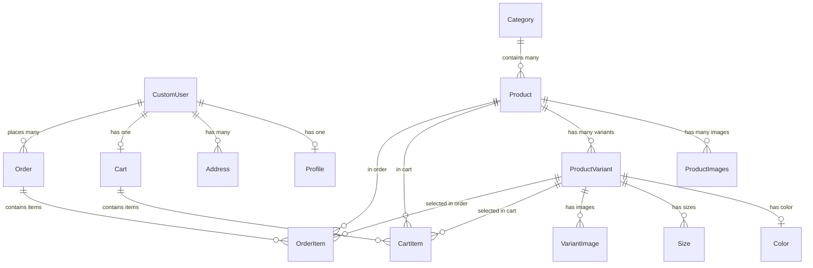

# Database Schema Documentation

## Overview

The database schema is designed to support a wholesale e-commerce platform with support for product variants, shopping carts, and order management. The schema uses SQLite for development and is compatible with PostgreSQL for production.

---

## Entity Relationship Diagram



---

## Models Documentation

### Accounts App

#### CustomUser

**Purpose**: Extended Django user model with email as primary authentication field

| Field | Type | Description | Constraints |
|-------|------|-------------|-------------|
| `username` | CharField(150) | Username for display | Unique |
| `email` | EmailField | Primary authentication field | Unique, Required |
| `phone` | CharField(20) | Phone number | Required |
| `address` | TextField | Primary address | Required |
| `is_active` | BooleanField | Account activation status | Default: False (requires admin approval) |
| `is_staff` | BooleanField | Staff status | Default: False |
| `is_superuser` | BooleanField | Superuser status | Default: False |

**Key Features**:

- **USERNAME_FIELD**: `email`
- **REQUIRED_FIELDS**: `['username', 'phone', 'address']`
- Inherits from `AbstractUser`
- Custom authentication backend supports email/phone login

#### Profile

**Purpose**: Additional user profile information with image

| Field | Type | Description | Constraints |
|-------|------|-------------|-------------|
| `user` | OneToOneField(CustomUser) | User relationship | Cascade on delete |
| `bio` | TextField | User biography | Optional |
| `image` | ImageField | Profile picture | Optional, Compressed on save |

**Key Features**:

- Uses `ImageCompressionMixin` for automatic image optimization
- Auto-created via signals when user is created
- Upload path: `user-image/`

#### Address

**Purpose**: Multiple shipping addresses per user

| Field | Type | Description | Constraints |
|-------|------|-------------|-------------|
| `user` | ForeignKey(CustomUser) | User relationship | Cascade on delete |
| `label` | CharField(50) | Address label (e.g., "Home") | Default: "المنزل" |
| `street` | CharField(255) | Street address | Required |
| `city` | CharField(100) | City | Required |
| `state` | CharField(100) | State/Province | Required |
| `postal_code` | CharField(20) | Postal code | Optional |
| `country` | CharField(100) | Country | Default: "مصر" |
| `is_default` | BooleanField | Default address flag | Default: False |

---

### Products App

#### Category

**Purpose**: Product categorization

| Field | Type | Description | Constraints |
|-------|------|-------------|-------------|
| `name` | CharField(200) | Category name | Required |
| `slug` | CharField(255) | URL-friendly name | Unique, Auto-generated, Indexed |
| `description` | TextField | Category description | Optional |
| `image` | ImageField | Category image | Required, Compressed on save |

**Indexes**:

- `slug` (unique index for fast URL lookups)

#### Product

**Purpose**: Main product information

| Field | Type | Description | Constraints |
|-------|------|-------------|-------------|
| `name` | CharField(200) | Product name | Required |
| `description` | TextField | Product description | Optional |
| `pcs_carton` | PositiveIntegerField | Pieces per carton | Default: 24 |
| `slug` | CharField(255) | URL-friendly name | Unique, Auto-generated, Indexed |
| `image` | ImageField | Main product image | Required, Compressed on save |
| `category` | ForeignKey(Category) | Product category | Nullable, SET_NULL on delete |
| `is_available` | BooleanField | Availability status | Default: True, Indexed |
| `created_at` | DateTimeField | Creation timestamp | Auto-generated |
| `updated_at` | DateTimeField | Last update timestamp | Auto-updated |

**Indexes**:

- `['category', '-created_at']` (composite index for category listings)
- `['-created_at']` (for latest products)
- `['is_available']` (for filtering available products)

**Ordering**: `-created_at` (newest first)

#### ProductVariant

**Purpose**: Product variations (colors, sizes, etc.)

| Field | Type | Description | Constraints |
|-------|------|-------------|-------------|
| `product` | ForeignKey(Product) | Parent product | Cascade on delete |
| `variant_type` | CharField(20) | Type of variant | Choices: `[('color', 'اللون')]` |
| `name` | CharField(200) | Variant name | Required |
| `code` | CharField(50) | Variant SKU | Unique, Optional |
| `pcs_carton` | PositiveIntegerField | Pieces per carton for variant | Default: 24 |
| `image` | ImageField | Variant-specific image | Optional, Compressed on save |
| `color` | ForeignKey(Color) | Associated color | Nullable, SET_NULL on delete |
| `sizes` | ManyToManyField(Size) | Available sizes | Optional |
| `is_available` | BooleanField | Availability status | Default: True, Indexed |
| `created_at` | DateTimeField | Creation timestamp | Auto-generated |

**Indexes**:

- `['is_available']` (for filtering)
- `['product', 'is_available']` (composite index for product variant queries)

**Constraints**:

- `unique_together`: `['product', 'code']`

#### Color

**Purpose**: Available colors for variants

| Field | Type | Description | Constraints |
|-------|------|-------------|-------------|
| `name` | CharField(50) | Color name | Required |
| `hex_code` | CharField(7) | Hex color code | Required (e.g., #FF0000) |
| `created_at` | DateTimeField | Creation timestamp | Auto-generated |

**Ordering**: `name`

#### Size

**Purpose**: Available sizes/lengths for variants

| Field | Type | Description | Constraints |
|-------|------|-------------|-------------|
| `name` | CharField(50) | Size name | Required |
| `order` | PositiveIntegerField | Display order | Default: 0 |
| `created_at` | DateTimeField | Creation timestamp | Auto-generated |

**Ordering**: `['order', 'name']`

#### ProductImages

**Purpose**: Additional product images (gallery)

| Field | Type | Description | Constraints |
|-------|------|-------------|-------------|
| `product` | ForeignKey(Product) | Parent product | Cascade on delete |
| `image` | ImageField | Image file | Required, Compressed on save |
| `order` | PositiveIntegerField | Display order | Default: 0 |
| `created_at` | DateTimeField | Creation timestamp | Auto-generated |

**Ordering**: `['order', 'created_at']`

#### VariantImage

**Purpose**: Multiple images for product variants

| Field | Type | Description | Constraints |
|-------|------|-------------|-------------|
| `variant` | ForeignKey(ProductVariant) | Parent variant | Cascade on delete |
| `image` | ImageField | Image file | Required, Compressed on save |
| `order` | PositiveIntegerField | Display order | Default: 0 |
| `created_at` | DateTimeField | Creation timestamp | Auto-generated |

**Ordering**: `['order', 'created_at']`

---

### Cart App

#### Cart

**Purpose**: Shopping cart container for authenticated users

| Field | Type | Description | Constraints |
|-------|------|-------------|-------------|
| `user` | OneToOneField(CustomUser) | Cart owner | Cascade on delete |
| `created_at` | DateTimeField | Creation timestamp | Auto-generated |
| `updated_at` | DateTimeField | Last update timestamp | Auto-updated |

**Methods**:

- `get_item_count()`: Returns total quantity across all items

#### CartItem

**Purpose**: Individual items in shopping cart

| Field | Type | Description | Constraints |
|-------|------|-------------|-------------|
| `cart` | ForeignKey(Cart) | Parent cart | Cascade on delete |
| `product` | ForeignKey(Product) | Product | Cascade on delete |
| `variant` | ForeignKey(ProductVariant) | Selected variant | Nullable, SET_NULL on delete |
| `quantity` | PositiveIntegerField | Quantity (always in pieces) | Default: 1 |
| `unit_type` | CharField(10) | Unit type | Choices: `[('piece', 'قطعة'), ('carton', 'كرتونة')]` |
| `size_name` | CharField(100) | Selected size name | Optional |

**Constraints**:

- `unique_together`: `['cart', 'product', 'variant', 'unit_type', 'size_name']`

**Methods**:

- `get_pcs_carton()`: Returns pcs_carton from variant or product
- `get_quantity_in_cartons()`: Converts pieces to cartons
- `get_quantity_in_pieces()`: Returns quantity in pieces
- `get_display_name()`: Returns formatted product name with variant info

---

### Orders App

#### Order

**Purpose**: Customer order container

| Field | Type | Description | Constraints |
|-------|------|-------------|-------------|
| `user` | ForeignKey(CustomUser) | Order owner | Cascade on delete |
| `created_at` | DateTimeField | Order creation time | Auto-generated |
| `updated_at` | DateTimeField | Last update time | Auto-updated |
| `status` | CharField(20) | Order status | Choices (see below), Default: 'pending' |
| `phone_number` | CharField(20) | Contact phone | Required |
| `address` | TextField | Delivery address | Optional |
| `notes` | TextField | Order notes | Optional |

**Status Choices**:

- `pending`: قيد الانتظار
- `confirmed`: تم التأكيد
- `shipped`: تم الشحن
- `delivered`: تم التسليم
- `cancelled`: تم الإلغاء

**Ordering**: `-created_at` (newest first)

**Methods**:

- `get_total_pieces()`: Returns total pieces across all order items

#### OrderItem

**Purpose**: Individual items in an order (preserves variant info at order time)

| Field | Type | Description | Constraints |
|-------|------|-------------|-------------|
| `order` | ForeignKey(Order) | Parent order | Cascade on delete |
| `product` | ForeignKey(Product) | Product | Cascade on delete |
| `variant` | ForeignKey(ProductVariant) | Selected variant | Nullable, SET_NULL on delete |
| `quantity` | PositiveIntegerField | Quantity (always in pieces) | Default: 1 |
| `unit_type` | CharField(10) | Unit type | Choices: `[('piece', 'قطعة'), ('carton', 'كرتونة')]` |
| `variant_info` | CharField(200) | Preserved variant type | Optional |
| `variant_pcs_carton` | PositiveIntegerField | Preserved pcs/carton | Optional |
| `color_name` | CharField(100) | Preserved color name | Optional |
| `size_name` | CharField(100) | Preserved size name | Optional |

**Why Preserve Variant Info?**
Variant details (color, size, pcs_carton) are saved at order time to maintain historical accuracy even if product/variant is modified or deleted later.

**Methods**:

- `get_pcs_carton()`: Returns preserved or current pcs_carton
- `get_quantity_in_cartons()`: Converts pieces to cartons
- `get_quantity_in_pieces()`: Returns quantity in pieces
- `get_total_pieces()`: Same as quantity (for consistency)
- `get_display_name()`: Returns formatted name with color/size/variant info

---

## Database Migrations

### Migration Strategy

1. Create migrations: `python manage.py makemigrations`
2. Review migrations: Check generated files in `migrations/` folders
3. Apply migrations: `python manage.py migrate`
4. Rollback if needed: `python manage.py migrate app_name migration_name`

### Current Migration State

All apps have initial migrations with the current schema. The system uses Django's built-in migration framework for schema version control.

---

## Data Integrity

### Cascading Deletes

- Deleting a **User** → Deletes Profile, Addresses, Cart, Orders
- Deleting a **Product** → Deletes ProductImages, ProductVariants, CartItems, OrderItems
- Deleting a **Category** → Sets Product.category to NULL
- Deleting a **Cart** → Deletes all CartItems
- Deleting an **Order** → Deletes all OrderItems

### SET_NULL Behaviors

- Deleting a **Category** → Product.category = NULL
- Deleting a **ProductVariant** → CartItem.variant = NULL, OrderItem.variant = NULL
- Deleting a **Color** → ProductVariant.color = NULL

---

## Performance Considerations

### Indexes

Strategic indexes are placed on:

- **Slug fields**: Fast URL lookups
- **Foreign keys**: Join optimization
- **Filtering fields**: `is_available`, `status`
- **Composite indexes**: Category + created_at for listings

### Query Optimization

- Use `select_related()` for foreign key relationships
- Use `prefetch_related()` for reverse foreign keys and many-to-many
- Aggregate queries at database level
- Avoid N+1 queries with proper prefetching

---

## Backup and Maintenance

### Backup Strategy (Production)

```bash
# PostgreSQL backup
pg_dump dbname > backup.sql

# Restore
psql dbname < backup.sql
```

### Maintenance Tasks

1. Regular vacuum (PostgreSQL)
2. Index rebuilding if performance degrades
3. Log rotation for application logs
4. Media file cleanup for deleted records
