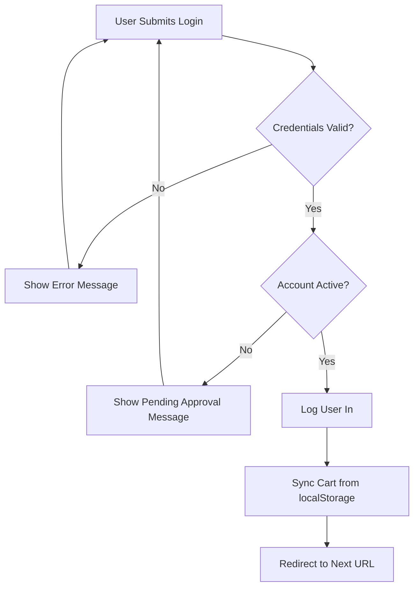

# Authentication & Authorization Documentation

## Overview

The Alwesam-Talabat platform implements a custom authentication system with email/phone login, admin approval workflow, and enhanced security features.

---

## Custom User Model

### Implementation

```python
# accounts/models.py
class CustomUser(AbstractUser):
    username = CharField(max_length=150, unique=True)
    email = EmailField(unique=True)
    phone = CharField(max_length=20)
    address = TextField()
    
    USERNAME_FIELD = 'email'
    REQUIRED_FIELDS = ['username', 'phone', 'address']
```

### Key Features

- **Email as Primary Identifier**: Users log in with email (not username)
- **Mandatory Fields**: Username, email, phone, and address are required
- **Unique Constraints**: Both email and username must be unique
- **Inherits from**: `django.contrib.auth.models.AbstractUser`

---

## Authentication Backend

### Custom Backend Implementation

```python
# accounts/backends.py
class EmailPhoneBackend(ModelBackend):
    def authenticate(self, request, username=None, password=None, **kwargs):
        # Try email first
        # Try phone second
        # Validate password
        # Return user or None
```

### Authentication Flow

1. **User submits**: Email/phone + password
2. **Backend tries**: Match by email → Match by phone
3. **Validate password**: Check against hashed password
4. **Check active status**: Only active users can log in
5. **Return result**: User object or None

### Configuration

```python
# project/settings.py
AUTHENTICATION_BACKENDS = [
    'accounts.backends.EmailPhoneBackend',  # Custom
    'django.contrib.auth.backends.ModelBackend',  # Fallback
]
```

---

## User Registration & Approval Workflow

### Registration Process

#### Step 1: User Signup

```python
# accounts/views.py
def signup_view(request):
    user = form.save(commit=False)
    user.is_active = False  # Requires admin approval
    user.save()
    return redirect('accounts:pending_approval')
```

**Form Fields**:

- Username
- Email (unique)
- Phone (unique)
- Address
- Password (with confirmation)

#### Step 2: Pending Approval

User is redirected to a "pending approval" page with message:
> "حسابك في انتظار موافقة المسؤول. سيتم إشعارك عند تفعيل حسابك."

#### Step 3: Admin Review

Admin reviews new users in `/admin-panel/users/pending/`:

- **Approve**: Sets `is_active=True` → User can log in
- **Reject**: Deletes user account

#### Step 4: User Login

Once approved, user can log in normally.

---

## Login System

### Login View

```python
@ratelimit(key='ip', rate='5/m', method='POST', block=True)
def login_view(request):
    user = authenticate(request, username=username_or_phone, password=password)
    
    if user and user.is_active:
        login(request, user)
        sync_cart_on_login(request)
        return redirect(next_url)
```

### Features

- **Dual Input**: Accepts email OR phone
- **Rate Limiting**: 5 login attempts per minute (per IP)
- **Active Check**: Only active users can log in
- **Cart Sync**: Merges guest cart with user cart on login
- **Next URL**: Supports redirect after login

### Login Flow Diagram



---

## Password Security

### Validation Rules

Configured via Django's built-in validators:

```python
AUTH_PASSWORD_VALIDATORS = [
    {'NAME': 'UserAttributeSimilarityValidator'},  # Not similar to user info
    {'NAME': 'MinimumLengthValidator'},            # Minimum 8 characters
    {'NAME': 'CommonPasswordValidator'},           # Not in common passwords list
    {'NAME': 'NumericPasswordValidator'},          # Not entirely numeric
]
```

### Password Hashing

- **Algorithm**: PBKDF2 with SHA256
- **Iterations**: 600,000 (Django 5.2 default)
- **Salting**: Automatic per-password unique salt

---

## Session Management

### Configuration

```python
# Default Django session settings
SESSION_ENGINE = 'django.contrib.sessions.backends.db'
SESSION_COOKIE_AGE = 1209600  # 2 weeks
SESSION_COOKIE_HTTPONLY = True
SESSION_COOKIE_SECURE = False  # Set to True in production with HTTPS
```

### Session Data Storage

The application stores:

- **User ID**: For authentication
- **Theme**: `theme-light` or `theme-dark`
- **Language**: `ar` or `en`
- **Cart Sync**: Temporary cart data during sync

### Session Endpoints

```python
# Set theme
POST /accounts/set-theme/
{"theme": "theme-light"}

# Set language
POST /accounts/set-language/
{"language": "ar"}
```

---

## Permission System

### Permission Levels

#### 1. **Anonymous Users**

Can access:

- ✅ Homepage
- ✅ Product catalog
- ✅ Product details
- ✅ Category pages
- ✅ Search
- ✅ Login/Signup pages

Cannot access:

- ❌ Cart
- ❌ Checkout
- ❌ Orders
- ❌ Profile
- ❌ Admin panel

#### 2. **Authenticated Users** (`@login_required`)

Can access all of the above, plus:

- ✅ View/manage cart
- ✅ Create orders
- ✅ View order history
- ✅ Profile management
- ✅ Address management

Cannot access:

- ❌ Admin panel

#### 3. **Staff Members** (`@staff_member_required`)

Can access everything, plus:

- ✅ Custom admin panel (`/admin-panel/`)
- ✅ Product management (CRUD)
- ✅ Category management (CRUD)
- ✅ Order management
- ✅ User approval/management

#### 4. **Superusers**

Can access everything, plus:

- ✅ Django admin (`/admin/`)

### Permission Decorators

```python
from django.contrib.auth.decorators import login_required
from django.contrib.admin.views.decorators import staff_member_required

@login_required
def profile_view(request):
    # User must be logged in
    pass

@staff_member_required
def admin_dashboard(request):
    # User must be staff
    pass
```

---

## Middleware

### CheckUserActiveMiddleware

Custom middleware that checks if authenticated users are still active:

```python
# accounts/middleware.py
class CheckUserActiveMiddleware:
    def __call__(self, request):
        if request.user.is_authenticated and not request.user.is_active:
            logout(request)
            messages.warning(request, 'Your account has been deactivated')
            return redirect('accounts:login')
```

**Purpose**: Immediately logs out users if their account is deactivated by admin.

---

## Rate Limiting

### Implementation

Uses `django-ratelimit` package:

```python
from django_ratelimit.decorators import ratelimit

@ratelimit(key='ip', rate='5/m', method='POST', block=True)
def login_view(request):
    # Limited to 5 POST requests per minute per IP
    pass
```

### Configured Limits

- **Login**: 5 attempts/minute (per IP)
- **Cart operations**: 30 requests/minute (per user)

### Rate Limit Constants

```python
# core/constants.py
LOGIN_RATE_LIMIT = '5/m'
CART_RATE_LIMIT = '30/m'
MAX_QUANTITY_PER_ITEM = 10000
```

---

## Theme & Language Preferences

### Theme System

Users can toggle between light and dark modes:

```javascript
// Frontend
fetch('/accounts/set-theme/', {
    method: 'POST',
    headers: {
        'Content-Type': 'application/json',
        'X-CSRFToken': csrfToken
    },
    body: JSON.stringify({theme: 'theme-dark'})
})
```

```python
# Backend
def set_theme(request):
    theme = request.json['theme']
    request.session['theme'] = theme
    return JsonResponse({'success': True})
```

### Language System

Similar to theme, supports Arabic and English:

```python
LANGUAGES = [
    ('ar', 'العربية'),
    ('en', 'English'),
]
```

---

## CSRF Protection

### Implementation

All POST/PUT/DELETE requests require CSRF token:

```html
<!-- In forms -->
<form method="post">
    
    <!-- form fields -->
</form>
```

```javascript
// In AJAX requests
fetch(url, {
    method: 'POST',
    headers: {
        'X-CSRFToken': getCookie('csrftoken')
    }
})
```

### Configuration

```python
MIDDLEWARE = [
    'django.middleware.csrf.CsrfViewMiddleware',
    # other middleware
]
```

---

## Security Best Practices

### Implemented Security Measures

1. **Password Security**:
   - Strong password validation
   - PBKDF2 hashing with 600k iterations
   - Unique salts per password

2. **Session Security**:
   - HttpOnly cookies (prevents XSS access)
   - Secure cookies in production (HTTPS only)
   - Session expiry (2 weeks)

3. **Input Validation**:
   - Form validation on all user inputs
   - Django ORM prevents SQL injection
   - Template auto-escaping prevents XSS

4. **Rate Limiting**:
   - Login attempt limiting
   - Prevents brute-force attacks

5. **CSRF Protection**:
   - All state-changing operations protected
   - Token validation on server-side

6. **Access Control**:
   - Route-level authentication checks
   - Permission-based authorization
   - Admin approval workflow

7. **Secure Configuration**:
   - SECRET_KEY in environment variables
   - DEBUG=False in production
   - ALLOWED_HOSTS properly configured

---

## Production Security Checklist

### Before Deployment

- [ ] Set `DEBUG = False`
- [ ] Configure `ALLOWED_HOSTS` with actual domains
- [ ] Use environment variables for `SECRET_KEY`
- [ ] Enable `SESSION_COOKIE_SECURE = True` (HTTPS)
- [ ] Enable `CSRF_COOKIE_SECURE = True` (HTTPS)
- [ ] Set up HTTPS/SSL certificates
- [ ] Configure secure headers middleware
- [ ] Review and limit CORS settings
- [ ] Enable database connection encryption
- [ ] Set up regular security audits
- [ ] Implement logging and monitoring
- [ ] Configure firewall rules

---

## Common Authentication Flows

### New User Flow

```
1. User visits /accounts/signup/
2. Fills registration form
3. Account created with is_active=False
4. Redirected to pending approval page
5. Admin reviews in /admin-panel/users/pending/
6. Admin approves → is_active=True
7. User can now log in
```

### Login Flow

```
1. User visits /accounts/login/
2. Enters email/phone + password
3. Backend authenticates (email/phone check)
4. Check if user.is_active
5. If active: Login + sync cart + redirect
6. If inactive: Show pending message
7. If invalid: Show error message
```

### Cart Sync on Login Flow

```
1. User logs in
2. JavaScript sends localStorage cart to /cart/sync/
3. Backend merges guest cart with user cart
4. Duplicates are combined (quantities summed)
5. localStorage cart is cleared
6. User sees merged cart
```

---

## Testing Authentication

### Manual Testing Checklist

- [ ] Signup with valid data → Account created (inactive)
- [ ] Login before approval → Pending message shown
- [ ] Admin approves user → Can log in
- [ ] Login with email → Success
- [ ] Login with phone → Success
- [ ] Login with wrong password → Error
- [ ] Logout → Redirected to homepage
- [ ] Access protected page without login → Redirect to login
- [ ] Rate limit: 6th login attempt within 1 min → Blocked
- [ ] Change theme → Persists across pages
- [ ] Change language → UI updates

### Unit Tests

(Project has test files but implementation needed)

```python
# accounts/tests.py
# TODO: Add comprehensive test coverage
```

---

## Troubleshooting

### Common Issues

**Issue**: User can't log in after signup
**Solution**: Check if account is active (admin approval needed)

**Issue**: Rate limit exceeded
**Solution**: Wait 1 minute or clear IP-based cache

**Issue**: Cart not syncing on login
**Solution**: Check browser localStorage and CSRF token

**Issue**: Session lost frequently
**Solution**: Check `SESSION_COOKIE_AGE` setting

**Issue**: CSRF verification failed
**Solution**: Ensure CSRF token is included in POST requests
